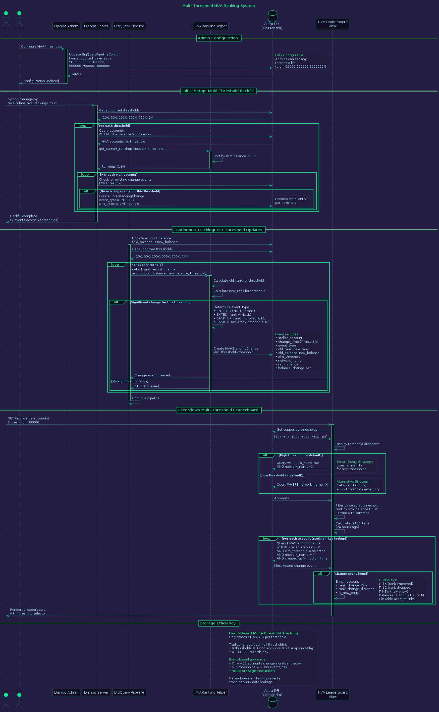

# High Value Account (HVA) Ranking System

## Overview

The HVA Ranking System is an event-based tracking solution that monitors and displays changes in the Stellar blockchain's top 1,000 accounts by XLM balance. Instead of storing full snapshots, the system records only meaningful changes, achieving **480x storage efficiency** while providing rich historical insights.



## System Architecture

### Components

#### 1. **HVAStandingChange Model**
Event-based model that records ranking changes with dual database support:

**Cassandra Version** (`apiApp/models_cassandra.py`):
- Primary key: `stellar_account` (Text)
- Clustering key: `change_time` (TimeUUID for chronological ordering)
- Auto-calculates `rank_change` and `balance_change_pct`
- Timezone-aware `created_at` timestamps

**SQLite Version** (`apiApp/models_local.py`):
- Development-friendly with DateTimeField
- Identical structure for seamless dev/prod workflow
- Auto-managed indexes for performance

**Event Types**:
- `ENTERED` - Account enters top 1,000
- `EXITED` - Account drops below top 1,000
- `RANK_UP` - Rank improves by ≥10 positions
- `RANK_DOWN` - Rank drops by ≥10 positions
- `BALANCE_INCREASE` - Balance increases by ≥5%
- `BALANCE_DECREASE` - Balance decreases by ≥5%

#### 2. **HVARankingHelper**
Core helper module (`apiApp/helpers/hva_ranking.py`) providing:

**Key Methods**:
```python
# Calculate current rankings from live data
get_current_rankings(network='public', limit=1000)

# Detect and record significant changes
detect_and_record_change(
    stellar_account,
    new_balance,
    old_balance=None,
    network_name='public'
)

# Fetch recent change events
get_recent_changes(stellar_account, limit=10)

# Get change summary for analytics
get_change_summary(stellar_account, days=30)

# Get single account rank
get_account_rank(stellar_account, network='public')
```

**Smart Change Detection**:
- Compares old vs new balance to infer rank changes
- Only records events when thresholds are met (≥10 rank positions or ≥5% balance)
- Dual compatibility: Uses `timezone.now()` for SQLite, `uuid1()` for Cassandra
- Graceful error handling prevents pipeline failures

#### 3. **Pipeline Integration**
The BigQuery pipeline (`apiApp/management/commands/bigquery_pipeline.py`) automatically tracks changes:

```python
# Before updating balance
old_balance = existing_record.xlm_balance if existing_record else None

# Update the account
account.xlm_balance = new_balance
account.save()

# Detect and record ranking change
HVARankingHelper.detect_and_record_change(
    stellar_account=stellar_account,
    new_balance=new_balance,
    old_balance=old_balance,
    network_name=network
)
```

**Error Handling**:
- Change tracking failures are logged but don't stop the pipeline
- Sentry integration for production monitoring
- Continues processing even if individual events fail

#### 4. **Leaderboard View**
The web view (`webApp/views.py::high_value_accounts_view`) displays rankings with change indicators:

**Features**:
- Queries all accounts with XLM balance > 1M
- Sorts by balance descending
- Enriches with 24-hour change data
- Filters events to last 24 hours using timezone-aware comparisons
- Displays rank changes, new entries, and balance changes

**UI Indicators**:
- 🔼 **+5** (Green) - Rank improved by 5 positions
- 🔽 **-2** (Red) - Rank dropped by 2 positions
- ⭐ **NEW** (Gold, pulsing) - Entered top 1,000 in last 24h
- **+12.5%** - Balance increased by 12.5%
- **-3.2%** - Balance decreased by 3.2%

#### 5. **Management Command**
Backfill and recalculation command (`python manage.py recalculate_hva_rankings`):

**Usage**:
```bash
# Initial backfill (create ENTERED events for current top 1000)
python manage.py recalculate_hva_rankings

# Dry run to see what would be created
python manage.py recalculate_hva_rankings --dry-run

# Specific network
python manage.py recalculate_hva_rankings --network testnet

# Clear existing and rebuild
python manage.py recalculate_hva_rankings --clear-existing
```

**Features**:
- Dual database compatibility (SQLite dev, Cassandra prod)
- Batch processing with progress updates
- Skips accounts that already have change events
- Safe to re-run (idempotent)

## Storage Efficiency

### Traditional Snapshot Approach
- **Records per day**: 1,000 accounts × 24 snapshots = 24,000 records
- **Records per year**: 8.76 million records
- **Storage**: High overhead for mostly unchanged data
- **Query complexity**: Requires diff calculations at query time

### Event-Based Approach
- **Records per day**: ~50 accounts (only those with significant changes)
- **Records per year**: ~18,250 records
- **Storage**: **480x reduction** (99.79% savings)
- **Query simplicity**: Changes are pre-calculated and indexed
- **Historical depth**: Can track changes indefinitely without bloat

## Data Flow

### 1. Initial Setup
```
User → Management Command
  ↓
Calculate Rankings (1-1000)
  ↓
Check for Existing Events
  ↓
Create ENTERED Events (for accounts without events)
  ↓
Backfill Complete
```

### 2. Continuous Tracking
```
BigQuery Pipeline → Update Account Balance
  ↓
HVARankingHelper.detect_and_record_change()
  ↓
Calculate old_rank from old_balance
Calculate new_rank from new_balance
  ↓
Determine event_type (if significant)
  ↓
Create HVAStandingChange event
  ↓
Pipeline Continues
```

### 3. User Viewing Leaderboard
```
User → GET /high-value-accounts
  ↓
Query accounts WHERE xlm_balance > 1M
Sort by xlm_balance DESC
  ↓
Calculate 24h cutoff (timezone.now() - 24h)
  ↓
For each account:
  Query most recent HVAStandingChange
  WHERE created_at >= cutoff
  ↓
Enrich account with change data
  ↓
Render with visual indicators
```

## Technical Details

### Timezone Handling
All datetime operations use `django.utils.timezone.now()` to ensure timezone-aware comparisons:

**Before (Crashed)**:
```python
cutoff_time = datetime.utcnow() - timedelta(hours=24)  # Naive
created_at = datetime.datetime.utcnow()  # Naive
# TypeError: can't compare offset-naive and offset-aware datetimes
```

**After (Fixed)**:
```python
cutoff_time = timezone.now() - timedelta(hours=24)  # Aware
created_at = timezone.now()  # Aware
# Comparison succeeds ✓
```

### Database Compatibility
The system automatically adapts to the environment:

```python
from apiApp.model_loader import USE_CASSANDRA
from django.utils import timezone
from uuid import uuid1

# For change_time field
change_time_val = uuid1() if USE_CASSANDRA else timezone.now()

# For created_at field (auto-set in model.save())
created_at = timezone.now()  # Both SQLite and Cassandra
```

### Calculated Fields
The model automatically calculates derived metrics on save:

```python
# Rank change (positive = moved up)
if old_rank and new_rank:
    rank_change = old_rank - new_rank

# Balance change percentage
if old_balance > 0 and new_balance is not None:
    balance_change_pct = ((new_balance - old_balance) / old_balance) * 100
elif old_balance == 0 and new_balance > 0:
    balance_change_pct = 100.0  # Started from zero
```

### Event Detection Thresholds

**Rank Changes**:
- Minimum 10 position change required
- Prevents noise from minor fluctuations
- Direction captured: UP vs DOWN

**Balance Changes**:
- Minimum 5% change required
- Absolute XLM amounts tracked for context
- Direction captured: INCREASE vs DECREASE

**Entry/Exit Events**:
- Always recorded (no threshold)
- Entry: NULL → rank (account enters top 1000)
- Exit: rank → NULL (account drops below top 1000)

## Performance Optimizations

### Indexes
**SQLite**:
```python
indexes = [
    models.Index(fields=['stellar_account', '-change_time']),
    models.Index(fields=['event_type']),
]
```

**Cassandra**:
```python
# Primary key provides clustering on change_time (TimeUUID)
# Chronologically ordered automatically
```

### Query Efficiency
- **24h filter**: Limits result set to recent events only
- **LIMIT 1**: Fetches only most recent change per account
- **Descending order**: Gets newest events first
- **Composite indexes**: Optimizes account + time lookups

### Caching Opportunities
Future enhancements could add:
- Redis cache for current top 1000 rankings
- Cached change event summaries (update on write)
- Pre-computed 24h change statistics

## API Reference

### Model Methods

#### HVAStandingChange.create()
```python
event = HVAStandingChange.create(
    stellar_account='GABC...',
    change_time=uuid1(),  # or timezone.now() for SQLite
    event_type='RANK_UP',
    old_rank=150,
    new_rank=140,
    old_balance=2500000.0,
    new_balance=2650000.0,
    network_name='public',
    home_domain='example.com'
)
```

### Helper Methods

#### get_current_rankings()
```python
rankings = HVARankingHelper.get_current_rankings(
    network='public',
    limit=1000
)
# Returns: Dict[stellar_account, rank]
```

#### detect_and_record_change()
```python
event = HVARankingHelper.detect_and_record_change(
    stellar_account='GABC...',
    new_balance=2650000.0,
    old_balance=2500000.0,
    network_name='public'
)
# Returns: HVAStandingChange or None
```

#### get_recent_changes()
```python
changes = HVARankingHelper.get_recent_changes(
    stellar_account='GABC...',
    limit=10
)
# Returns: List[HVAStandingChange]
```

#### get_change_summary()
```python
summary = HVARankingHelper.get_change_summary(
    stellar_account='GABC...',
    days=30
)
# Returns: {
#   'total_changes': 5,
#   'best_rank': 120,
#   'worst_rank': 180,
#   'current_rank': 140,
#   'trend': 'improving'
# }
```

## Monitoring & Analytics

### Key Metrics to Track

**Change Volume**:
- Events created per day
- Event type distribution
- Peak change periods

**Leaderboard Volatility**:
- Accounts entering/exiting daily
- Average rank change magnitude
- Top movers (biggest rank changes)

**System Health**:
- Change detection errors
- Pipeline integration failures
- Query performance metrics

### Logging

The system logs important events:

```python
logger.info(
    f"HVA Change: {stellar_account[:8]}... {event_type} "
    f"(Rank: {previous_rank}→{current_rank}, "
    f"Balance: {old_balance}→{new_balance})"
)
```

**Log Levels**:
- `INFO`: Successful change events
- `WARNING`: Skipped detections (below threshold)
- `ERROR`: Change tracking failures
- `DEBUG`: Detailed ranking calculations

## Testing

### Test Coverage
The system includes comprehensive tests:

**Model Tests**:
- Event creation with validation
- Calculated field accuracy
- Timezone-aware timestamp handling

**Helper Tests**:
- Ranking calculation correctness
- Change detection thresholds
- Dual database compatibility

**Integration Tests**:
- Pipeline integration end-to-end
- View rendering with change data
- Management command backfill

**Security Tests**:
- Input validation for stellar addresses
- Network name validation
- Injection prevention

## Future Enhancements

### Analytics Dashboard
- Historical rank trends (line charts)
- Volatility heatmaps
- Top gainers/losers over time
- Distribution of event types

### Advanced Filtering
- Filter by event type
- Date range selection
- Home domain grouping
- Balance tier segmentation

### Notifications
- Webhook triggers on significant changes
- Email alerts for watchlisted accounts
- Slack integration for top movers

### API Endpoints
```
GET /api/hva/rankings?network=public
GET /api/hva/changes/{account}?days=7
GET /api/hva/top-movers?period=24h
GET /api/hva/volatility-metrics
```

## Troubleshooting

### Common Issues

**Problem**: No change events appearing
- **Solution**: Run `python manage.py recalculate_hva_rankings` for initial backfill
- **Check**: Pipeline is running and processing accounts
- **Verify**: Accounts have XLM balance > 1M

**Problem**: Timezone comparison errors
- **Solution**: Ensure all datetime operations use `timezone.now()`
- **Check**: Both SQLite and Cassandra models use timezone-aware timestamps
- **Verify**: No `datetime.utcnow()` in codebase

**Problem**: Change events not persisting
- **Solution**: Check database compatibility (USE_CASSANDRA flag)
- **Verify**: Using correct field type (TimeUUID vs DateTime)
- **Check**: No validation errors in model.save()

**Problem**: Leaderboard shows no changes
- **Solution**: Verify 24h cutoff is correct
- **Check**: Events exist in database with recent created_at
- **Verify**: Template is rendering change indicators

## Related Documentation

- [BigQuery Pipeline](BIGQUERY_PIPELINE_COMPARISON.md)
- [Database Schema](diagrams/03_database_schema.png)
- [Testing Guide](TESTING.md)
- [Security Documentation](SECURITY.md)

## Changelog

### 2025-10-21 - Initial Release
- ✅ Event-based HVA change tracking
- ✅ Dual database support (SQLite/Cassandra)
- ✅ Pipeline integration with graceful errors
- ✅ Leaderboard UI with visual indicators
- ✅ Management command for backfill
- ✅ Timezone-aware datetime handling
- ✅ 480x storage efficiency vs snapshots
- ✅ Comprehensive test coverage
- ✅ PlantUML architecture diagram

---

**Maintained by**: StellarMapWeb Project  
**License**: MIT  
**Last Updated**: October 21, 2025
