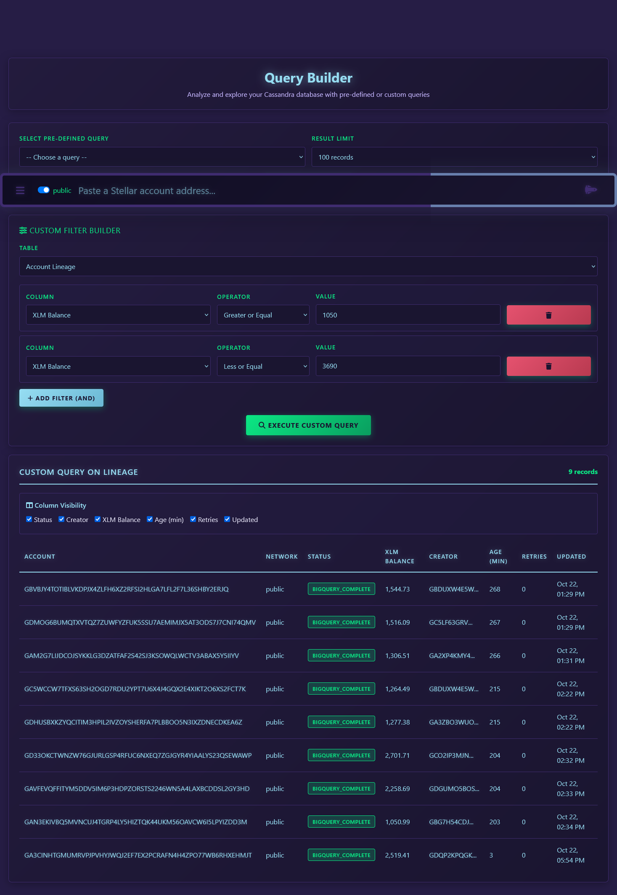

# StellarMapWeb

StellarMapWeb is a Django application designed to visualize Stellar blockchain lineage data. It collects account creation relationships from multiple sources using a triple-pipeline architecture: (1) BigQuery/Hubble dataset for fast bulk processing, (2) Horizon API/Stellar Expert for reliable sequential processing, and (3) Stellar SDK for free, concurrent async processing. Data is stored in Astra DB (Cassandra) and rendered as interactive D3.js radial tree diagrams. The project aims to provide users with a clear, interactive "family tree" view of how Stellar accounts are created and interconnected. The application features three complementary pipelines for optimal performance and cost efficiency: SDK Pipeline (free, 30-60s per account, concurrent), API Pipeline (free, 2-3 min per account, sequential), and BigQuery Pipeline (fast but costs $0.18-0.71 per query). All pipelines discover up to 100,000 child accounts per parent, feature robust validation, and provide real-time pending account tracking.

## 📚 Documentation

### Core Documentation
- 🏗️ **[Technical Architecture](TECHNICAL_ARCHITECTURE.md)** - Complete technical documentation with 9 PlantUML diagrams covering system architecture, data pipelines, database schema, and deployment
- 📖 **[User Guide](USER_GUIDE.md)** - End-user documentation with screenshots, feature walkthroughs, and usage examples
- 🧪 **[Testing Guide](TESTING.md)** - Comprehensive testing guide with pytest markers, admin portal regression tests, and CI/CD configuration

### Feature Documentation
- ⚡ **[Triple-Pipeline Implementation](TRIPLE_PIPELINE_IMPLEMENTATION.md)** - Triple-pipeline architecture (BigQuery, API, and SDK pipelines) with cost optimization and performance details
- 🏆 **[HVA Ranking System](HVA_RANKING_SYSTEM.md)** - Multi-threshold High-Value Account ranking system with admin configuration and change tracking
- 🚀 **[Performance Optimizations](PERFORMANCE_OPTIMIZATIONS.md)** - Performance optimization guide with current status and recommendations

### Additional Resources
- 🔒 **[Security](SECURITY.md)** - Security practices, vulnerability reporting, and secure configuration guidelines
- 🤝 **[Contributing](CONTRIBUTING.md)** - Contribution guidelines for developers

## Quick Start

### Replit Deployment
1. Create Python Repl and upload files
2. Install dependencies: `pip install -r requirements.txt`
3. Configure Secrets:
   - `DJANGO_SECRET_KEY` (generate secure key)
   - `DEBUG=True` (development only)
   - `ASTRA_DB_TOKEN`, `CASSANDRA_DB_NAME`, `CASSANDRA_KEYSPACE`
   - `SENTRY_DSN` (optional)
4. Run: Auto-runs migrate/server via `.replit` config
5. Access via Webview and input Stellar address

### Docker Deployment (Recommended for Local Dev)
```bash
# Copy environment template
cp .env.example .env

# Edit .env and set your DJANGO_SECRET_KEY (generate a secure one)
# For local dev, USE_SQLITE=True is already set
# Add GOOGLE_APPLICATION_CREDENTIALS_JSON for BigQuery access

# Start services (Django server + BigQuery pipeline)
docker-compose up -d

# View logs
docker-compose logs -f

# Stop services
docker-compose down
```

Access the application at `http://localhost:5000`

### Local Development (Without Docker)
```bash
# Set environment variables
export DJANGO_SECRET_KEY="your-secret-key"
export DEBUG="True"
export USE_SQLITE="True"

# Optional: For production Cassandra/Astra DB
# export ASTRA_DB_TOKEN="your-token"
# export CASSANDRA_DB_NAME="your-db-name"
# export CASSANDRA_KEYSPACE="your-keyspace"

# Install and run
pip install -r requirements.txt
python manage.py migrate
python manage.py runserver 0.0.0.0:5000
```

### Windows Local Development (SQLite Only)
For Windows development without Docker/Cassandra dependencies:

```bash
# 1. Copy environment template
copy .env.example .env

# 2. Edit .env file and set:
# - DJANGO_SECRET_KEY (generate a secure key)
# - ENV=development (uses SQLite database)
# - APP_PATH=. (required for Windows paths)

# 3. Install compatible Python packages
pip install Django==4.2.7 python-decouple==3.8 stellar-sdk==9.3.0 requests==2.31.0
pip install click==8.1.8 numpy==1.24.3 pandas==2.3.2 tenacity==9.1.2
pip install aiohttp==3.12.15 django-ratelimit==4.1.0 sentry-sdk==2.38.0
pip install django-cassandra-engine==1.8.0

# 4. Run migrations
python manage.py migrate --settings=StellarMapWeb.settings.settings_local

# 5. Start development server
python manage.py runserver 0.0.0.0:5000 --settings=StellarMapWeb.settings.settings_local
```

**Environment Configuration:**
The application automatically detects the environment using the `ENV` variable in `.env`:

- **`ENV=development`** → Uses SQLite database (local development)
- **`ENV=production`** → Uses Cassandra database (production deployment)

**Windows Setup Notes:**
- Uses SQLite database when `ENV=development` (no Cassandra/Astra DB required)
- Compatible with Python 3.9+
- BigQuery features disabled (API fallbacks available)
- All core functionality works (search, visualization, lineage display)
- Full admin portal with CRUD operations on all data models
- Access at `http://localhost:5000/`
- Admin interface at `http://localhost:5000/admin/`

**Admin Portal Access:**
To access the Django admin interface at `/admin/`:
```bash
python manage.py createsuperuser --settings=StellarMapWeb.settings.settings_local
```
Follow the prompts to create a username, email, and password. Then access the admin at `http://localhost:5000/admin/`.

**Admin Portal Features (Development Mode):**
The admin interface provides full CRUD access to all data models when running in local SQLite mode:

- **BigQuery Pipeline Configuration**: Manage cost controls, pipeline modes, and API settings
- **Stellar Account Search Cache**: View and manage cached search results with 12-hour freshness
- **Stellar Creator Account Lineage**: Browse account lineage data with creator relationships
- **Management Cron Health**: Monitor cron job health and status
- **Stellar Account Stage Execution**: Track pipeline execution progress with real-time status updates

**Key Admin Features:**
- Full create, read, update, delete operations on all models
- Advanced filtering and search capabilities
- Real-time data editing with immediate database updates
- Comprehensive field validation and error handling
- Responsive interface with mobile support

**Troubleshooting - Missing Tables:**
If you get "no such table" errors when accessing admin:
```bash
# The apiApp_bigquerypipelineconfig table should be auto-created
# If missing, run this script to create it manually:
python -c "
import sqlite3
conn = sqlite3.connect('db.sqlite3')
cursor = conn.cursor()
cursor.execute('''CREATE TABLE IF NOT EXISTS apiApp_bigquerypipelineconfig (
    config_id VARCHAR(50) PRIMARY KEY,
    bigquery_enabled BOOLEAN DEFAULT 1,
    cost_limit_usd REAL DEFAULT 0.71,
    size_limit_mb REAL DEFAULT 148900.0,
    pipeline_mode VARCHAR(50) DEFAULT \"SDK_ONLY\",
    instant_query_max_age_days INTEGER DEFAULT 365,
    api_fallback_enabled BOOLEAN DEFAULT 1,
    horizon_max_operations INTEGER DEFAULT 200,
    horizon_child_max_pages INTEGER DEFAULT 5,
    bigquery_max_children INTEGER DEFAULT 100000,
    bigquery_child_page_size INTEGER DEFAULT 10000,
    batch_processing_enabled BOOLEAN DEFAULT 1,
    batch_size INTEGER DEFAULT 100,
    cache_ttl_hours INTEGER DEFAULT 12,
    created_at DATETIME DEFAULT CURRENT_TIMESTAMP,
    updated_at DATETIME DEFAULT CURRENT_TIMESTAMP,
    updated_by VARCHAR(255) DEFAULT \"\",
    notes TEXT DEFAULT \"\"
)''')
cursor.execute('''INSERT OR IGNORE INTO apiApp_bigquerypipelineconfig (config_id, updated_by, notes) VALUES (\"default\", \"system\", \"Auto-created for local development\")''')
conn.commit()
conn.close()
print('Table created successfully')
"
```

### Run Tests
```bash
python manage.py test
```

---

## Screenshots

### Home Page

*Clean, cyberpunk-themed landing page with quick navigation to key features*

### Dashboard

*Comprehensive system monitoring with alerts, database health, lineage integrity, and performance metrics*

### Account Search & Radial Visualization

*Interactive D3.js radial tree visualization showing account lineage with spacing controls and zoom/pan*

### High Value Accounts Leaderboard

*Multi-threshold leaderboard system with configurable wealth tiers (10K, 50K, 100K, 500K, 750K, 1M XLM). Tracks accounts by balance with 24h rank change indicators and threshold-specific ranking history.*

**Additional Threshold Views:**
- [10K XLM View](docs/screenshots/hva-leaderboard-10k.png) - Entry-level significant accounts
- [50K XLM View](docs/screenshots/hva-leaderboard-50k.png) - Mid-tier holders
- [1M XLM View](docs/screenshots/hva-leaderboard-1M.png) - Premium whale accounts

### Query Builder


*Powerful Cassandra database explorer with 10 pre-defined queries and custom filter builder*

### Bulk Account Search

*Queue multiple Stellar accounts for batch processing*


*Processing results showing queued, duplicates, and invalid accounts*

### Admin Configuration

*Advanced pipeline configuration with cost limits, mode selection, and timeout controls*


*API rate limiting configuration and monitoring controls*

---

## Production Deployment Options

### Option 1: Hybrid Architecture (Recommended for Production)

Cost-effective hybrid deployment separating web app from background jobs:

**Architecture:**
```
Cloudflare (DDoS) → Replit Autoscale (Web App) → Astra DB
                          ↓
                    Linode VPS (Cron Jobs)
```

**Components:**
- **Replit Autoscale**: Web application (auto-scales 0 to N based on traffic)
- **Linode VPS**: BigQuery cron jobs (reliable 24/7 execution)
- **Cloudflare**: DDoS protection + CDN (free tier)
- **Astra DB**: Shared database for both services

**Setup:**
1. **Deploy web app to Replit Autoscale**:
   - Uses existing `.replit` deployment config
   - Auto-scales based on traffic
   - Scales to zero when idle (saves costs)

2. **Deploy cron jobs to Linode VPS**:
   ```bash
   # On Linode VPS
   docker compose -f docker-compose.cron.yml up -d
   ```
   - Runs BigQuery pipeline every hour
   - Always-on for reliable processing

**Total Cost: $10-32/month**
- Linode: $5-12/month (Nanode 1GB or Linode 2GB)
- Replit: ~$5-15/month (pay-per-use, scales to zero)
- Cloudflare: $0 (free tier)
- Astra DB: $0 (free tier, up to 80GB)
- BigQuery: $0-5/month (permanent storage model with cost controls v2.0)

**See:** [LINODE_DEPLOYMENT.md](./LINODE_DEPLOYMENT.md) for complete setup guide

### Option 2: Self-Hosted with Load Balancing

Full production stack with Nginx load balancer and Redis:

```bash
# For multi-instance production with Redis
docker compose -f docker-compose.redis.yml up -d

# For single instance testing
docker compose -f docker-compose.nginx.yml up -d
```

**Features:**
- Nginx load balancer across 2+ Django instances
- Redis for cluster-wide rate limiting
- Health checks and monitoring
- Cloudflare integration

**See:** [CLOUDFLARE_SETUP.md](./CLOUDFLARE_SETUP.md) for complete setup guide

### Option 3: Simple Docker Deployment

Single-instance deployment for small-scale production:

```bash
docker-compose up -d
```

Includes web server and BigQuery cron job in one stack.

---

## System Architecture

**📖 For detailed technical architecture, see [TECHNICAL_ARCHITECTURE.md](TECHNICAL_ARCHITECTURE.md)**

This comprehensive developer documentation includes:
- 8 detailed PlantUML architecture diagrams
- Database schema explanations
- API endpoint specifications
- Performance optimizations
- Security implementations
- Deployment strategies

**Quick Architecture Overview:**
- **Frontend:** Vue.js + D3.js for interactive visualizations
- **Backend:** Django 5.0.2 with multi-app structure
- **Database:** Astra DB (Cassandra) for production, SQLite for development
- **Data Sources:** Google BigQuery, Horizon API, Stellar Expert
- **Deployment:** Docker Compose with Nginx load balancing

---

### Framework and Structure
- **Django 4.2.7** with a multi-app architecture:
  - `apiApp`: API and data management
  - `webApp`: User interface
  - `radialTidyTreeApp`: Visualization components

### Database Architecture
- **Primary Storage**: Astra DB (DataStax Cassandra) for production using `django-cassandra-engine`. SQLite for local development.
- **Local Development**: Windows-compatible SQLite setup with `settings_local.py` that disables Cassandra dependencies
- **Database Routing**: Custom `DatabaseAppsRouter` for directing apps to appropriate databases.
- **ORM**: Combines Django ORM with direct Cassandra integration, explicitly using `__table_name__` for Cassandra models.
- **Schema Design**: Cassandra models use composite primary keys and clustering keys for efficient querying and include `created_at` and `updated_at` timestamps.
- **Horizon JSON Data Storage**: Stores Horizon API responses directly in Cassandra TEXT columns (`horizon_accounts_json`, `horizon_operations_json`, `horizon_effects_json`) on the `StellarCreatorAccountLineage` model. This approach provides simpler, more reliable data persistence using existing CQL credentials, replacing the previous REST API Document Collections approach that was incompatible with Classic Cassandra databases.
- **Caching**: 12-hour caching strategy for Stellar address searches using `StellarAccountSearchCache` to minimize API calls.

### Data Collection Pipeline

StellarMapWeb offers **5 pipeline configuration modes** via the admin panel:

1. **SDK_ONLY** 🆓 - Use only SDK Pipeline (free, concurrent, 30-60s/account) - **RECOMMENDED**
2. **API_ONLY** 🆓 - Use only API Pipeline (free, sequential, 2-3 min/account) - Reliable fallback
3. **API_AND_SDK** 🆓🆓 - Run **BOTH** pipelines simultaneously (free, maximum throughput) - Best for high-volume
4. **BIGQUERY_WITH_API_FALLBACK** 💰 - Try BigQuery first, fall back to free APIs if cost limits exceeded (costs $0.18-0.71/query)
5. **BIGQUERY_ONLY** 💰💰 - Only use BigQuery (costs money, may fail if limits exceeded) - **NOT RECOMMENDED**

**Recommendation:** Use **SDK_ONLY** for most cases, or **API_AND_SDK** for maximum free throughput.

#### BigQuery Pipeline (Primary Method - Permanent Storage Architecture)

**Architectural Principle:** BigQuery is ONLY queried for accounts never searched before. Once stored, lineage data is permanent in Cassandra.

**Data Flow:**
```
First-Time Search → BigQuery (lineage) → Cassandra (permanent storage)
                                               ↓
Repeat Search ──────────────────────────────→ Cassandra (0 BigQuery cost)
                                               ↓
Enrichment Refresh ──────────────────────→ Horizon/Stellar Expert APIs (free)
```

**Performance:**
- **First-Time Searches**: 50-90 seconds (BigQuery + Cassandra storage)
- **Repeat Searches**: <1 second (Cassandra cache, 0 BigQuery cost)
- **Processing Speed**: 2-3x faster than API approach for first-time searches
- **No Rate Limits**: Direct BigQuery access eliminates API throttling concerns

**BigQuery Queries (First-Time Only):**
  1. **Account Creation Date**: From Horizon API (free, optimized)
  2. **Creator Discovery**: Find parent account from `enriched_history_operations` (type=0)
  3. **Child Accounts**: Discover all child accounts created (paginated up to 100,000)

**API Queries (Every Search):**
  - **Account Details**: Balance, flags, home_domain from Horizon API (always fresh)
  - **Asset Holdings**: Current trustlines from Stellar Expert API (always fresh)

**Cost Controls v2.0 (Protection Against Runaway Costs):**
- **BigQueryCostGuard**: Validates ALL queries via dry-run before execution
- **100 MB Query Limit**: Strictly enforced - queries over 100 MB are blocked
- **Mandatory Partition Filters**: All `enriched_history_operations` queries require date ranges
- **Smart Fallbacks**: Pipeline continues gracefully when queries are blocked
- **Zero Risk**: The 10+ TiB cost overrun is now IMPOSSIBLE
- **See**: [BIGQUERY_COST_CONTROLS.md](./BIGQUERY_COST_CONTROLS.md) for complete details

**Cost Efficiency:**
- **Free Tier Coverage**: Up to 2,500-3,900 unique accounts/month (1 TB free tier)
- **Enterprise Scale**: 5,000 unique accounts/month = $1-5/month
- **Typical Deployment**: $0/month (within free tier indefinitely)
- **Key Insight**: Costs DECREASE over time as database grows (more cached accounts)
- **Actual Cost per Account**: ~$0.0001-0.0002 (less than 1 cent) with cost controls

**Comprehensive Discovery:**
- Pagination with 10,000-row batches, deduplication by account address
- Handles transactions creating multiple accounts (airdrops)
- Up to 100,000 child accounts per parent

#### BigQuery Pipeline Command
```bash
# Process up to 100 accounts
python manage.py bigquery_pipeline --limit 100

# Reset all accounts to PENDING
python manage.py bigquery_pipeline --reset
```

#### High Value Account (HVA) Ranking System

**Event-Based Change Tracking for Top 1,000 Accounts**

The HVA Ranking System provides efficient monitoring of Stellar's wealthiest accounts (>1M XLM) with intelligent change detection and storage optimization.

**Architecture:**
- **Event-Based Storage**: Records only meaningful changes, not full snapshots
- **480x Storage Efficiency**: ~50 events/day vs 24,000 snapshots/day
- **6 Event Types**: ENTERED, EXITED, RANK_UP, RANK_DOWN, BALANCE_INCREASE, BALANCE_DECREASE
- **Smart Thresholds**: Rank changes ≥10 positions, balance changes ≥5%
- **Dual Compatibility**: SQLite (dev) and Cassandra (prod) with timezone-aware timestamps

**Pipeline Integration:**
```python
# Automatic change detection in BigQuery pipeline
HVARankingHelper.detect_and_record_change(
    stellar_account=account,
    new_balance=new_balance,
    old_balance=old_balance,
    network_name='public'
)
```

**Management Commands:**
```bash
# Initial backfill - create ENTERED events for current top 1000
python manage.py recalculate_hva_rankings

# Dry run (see what would be created without making changes)
python manage.py recalculate_hva_rankings --dry-run

# Specific network
python manage.py recalculate_hva_rankings --network testnet

# Clear existing events and rebuild
python manage.py recalculate_hva_rankings --clear-existing
```

**UI Features:**
- 🔼 **+5** (Green) - Rank improved by 5 positions
- 🔽 **-2** (Red) - Rank dropped by 2 positions
- ⭐ **NEW** (Gold, pulsing) - Entered top 1,000 in last 24h
- **+12.5%** - Balance increased
- **-3.2%** - Balance decreased

**Performance:**
- **Queries**: Optimized with composite indexes (account + time)
- **Filtering**: 24-hour time window for recent changes
- **Scalability**: Handles indefinite event retention without bloat

**See:** [HVA_RANKING_SYSTEM.md](./HVA_RANKING_SYSTEM.md) for complete technical documentation, API reference, and troubleshooting guide.

#### API-Based Pipeline (Educational Reference)
- **Alternative Approach**: 8-stage sequential pipeline using Horizon API and Stellar Expert.
- **Processing Time**: 2-3 minutes per account.
- **Use Case**: Educational purposes, API-based data collection demonstrations.
- **Not Enabled**: Available in codebase (`run_cron_jobs.py`) but not configured to run by default.
- **8 Sequential Stages**:
  1. Make Parent Lineage
  2. Collect Horizon Data
  3. Collect Account Attributes
  4. Collect Account Assets
  5. Collect Account Flags
  6. Collect SE Directory
  7. Collect Account Creator
  8. Make Grandparent Lineage

#### Workflow Management
- **Comprehensive Tracking**: 18 status constants for tracking data collection:
  - `PENDING`, `IN_PROGRESS`, `DONE`, `RE_INQUIRY`
  - `FAILED`, `INVALID_HORIZON_STELLAR_ADDRESS` (terminal statuses)
  - Various stage-specific statuses

#### BigQuery Integration
- **Dataset**: `crypto-stellar.crypto_stellar_dbt` (Stellar Hubble public dataset)
- **Key Tables**:
  - `accounts_current`: Current account state (balance, flags, thresholds) - *DEPRECATED in favor of Horizon API*
  - `trust_lines_current`: Asset holdings and trustlines - *DEPRECATED in favor of Stellar Expert API*
  - `enriched_history_operations`: Complete blockchain history (operations, transactions) - **PRIMARY USE**
- **Authentication**: Google Cloud service account with BigQuery access (GOOGLE_APPLICATION_CREDENTIALS_JSON)
- **Cost Controls v2.0**: 
  - BigQueryCostGuard validates ALL queries via dry-run before execution
  - 100 MB query limit strictly enforced
  - Mandatory partition filters on `enriched_history_operations` (closed_at BETWEEN date range)
  - Account creation date from Horizon API (free) instead of BigQuery
- **Creator Attribution**: Queries `create_account` operations (type=0) for funder/creator identification.
- **Child Discovery**: Discovers all accounts where parent is the funder with proper pagination.

#### API Integration & Reliability (API Pipeline)
- **APIs Used**: Horizon API and Stellar Expert with asynchronous interactions (`async/await`).
- **Retry Logic**: `Tenacity` library for robust API calls with exponential backoff.
- **Validation**: Horizon API 404 validation catches invalid addresses.
- **Terminal Status**: `INVALID_HORIZON_STELLAR_ADDRESS` and `FAILED` are terminal statuses.

### Frontend Architecture

#### Templating & Visualization
- **Templating**: Django templates enhanced with Vue.js components for interactivity.
- **Visualization**: D3.js for interactive radial tree diagrams.
- **Responsive Design**: Bootstrap-based interface.
- **Multi-Theme System**: Dynamic theme switcher with 3 sci-fi themes (Cyberpunk default, Borg Green, Predator Red) that sync across admin portal and frontend pages in real-time via localStorage.

#### User Experience Features
- **Error Handling**: Graceful error handling for invalid Stellar addresses.
- **Default Display**: Default display of pending accounts.
- **Cache Prevention**: Browser caching prevented using `Cache-Control` headers.
- **High Value Account (HVA) Tracking**: Automatic identification and tagging of accounts with >1M XLM balance. Dedicated HVA page at `/web/high-value-accounts/` displays all high-value accounts with total balance statistics, sorted by balance descending. Uses efficient boolean-based filtering with `is_hva` column for scalable queries.
- **HVA Ranking System**: Event-based change tracking system that monitors the top 1,000 accounts by XLM balance, recording only meaningful changes (ENTERED, EXITED, RANK_UP, RANK_DOWN, BALANCE_INCREASE, BALANCE_DECREASE). Achieves **480x storage efficiency** vs traditional snapshot approaches. UI displays 24-hour rank changes with visual indicators (🔼 +5, 🔽 -2, ⭐ NEW). Dual database compatibility (SQLite dev, Cassandra prod) with timezone-aware timestamps. See [HVA_RANKING_SYSTEM.md](./HVA_RANKING_SYSTEM.md) for complete documentation.

#### Pending Accounts UI
- **Real-time Display**: Vue.js watcher displays all `PENDING`/`IN_PROGRESS`/`RE_INQUIRY` accounts from `StellarAccountSearchCache` and `StellarCreatorAccountLineage` tables.
- **Auto-Refresh**: Vue.js polling system refreshes Pending Accounts tab every 5 seconds via `/api/pending-accounts/` endpoint.
- **Lifecycle Management**: Immediate initial fetch and proper cleanup on component destruction.

#### Stages Monitoring
- **Real-time Progress**: Pipeline progress tracking showing execution time, status, and errors for each of the 8 stages per address.
- **API Endpoint**: `/api/stage-executions/` endpoint with 5-second auto-refresh in dedicated Stages tab.
- **Stage Details**:
  - Stage 1: Make Parent Lineage
  - Stage 2: Collect Horizon Data
  - Stages 3-8: Lineage enrichment

#### Immediate Stage Initialization
- **Instant Creation**: All 8 pipeline stages are created instantly when a new address is searched.
- **Immediate Visibility**: Stages appear immediately in the Stages tab with PENDING status before processing begins.
- **Helper Functions**: `initialize_stage_executions()` and `update_stage_execution()` ensure consistent stage lifecycle management with no duplicates.

#### Interactive JSON Viewer
- **Clickable Interface**: Stages tab includes clickable JSON icon in Actions column.
- **Modal Display**: Opens modal popup displaying complete stage execution data.
- **Formatted JSON**: Syntax-highlighted JSON with dark theme styling using highlight.js.
- **Graceful Fallback**: Falls back to plain JSON if highlight.js unavailable.

---

## Security and Monitoring

### Testing Framework
- **Comprehensive Test Suite**: 122+ tests across 8 test modules covering security, functionality, and monitoring.

#### Test Modules
1. **test_validator_security.py**: 16 tests for enhanced validator with ValidationError enforcement
2. **test_security_injection_prevention.py**: NoSQL injection, XSS, command injection, path traversal
3. **test_security_api_validation.py**: Stellar address validation, external API data validation, query parameters
4. **test_security_configuration.py**: Secrets management, environment variables, secure defaults
5. **test_security_frontend.py**: XSS prevention, CSRF protection, clickjacking prevention
6. **test_failed_status_handling.py**: Terminal status exclusion from cron processing
7. **test_stage_executions.py**: 17 tests for pipeline stage monitoring (model validation, API security, stage tracking, cron integration)
8. **test_stage_json_viewer.py**: 15 tests for interactive JSON viewer (template rendering, API data integrity, JSON formatting, security)

#### Test Coverage Areas
- ValidationError enforcement for malicious input (shell chars, path traversal, null bytes, invalid checksums)
- Injection Prevention (NoSQL injection, XSS, command injection, path traversal)
- API Input Validation (Stellar addresses, external API data, query parameters)
- Configuration Security (secrets management, environment variables, secure defaults)
- Frontend Security (XSS prevention, CSRF protection, clickjacking prevention)
- Terminal Status Handling (FAILED, INVALID_HORIZON_STELLAR_ADDRESS exclusion from recovery)

### Input Validation & Injection Prevention

#### Enhanced Validator with ValidationError Enforcement
- **Dual Mode Operation**: `StellarMapValidatorHelpers.validate_stellar_account_address()` supports:
  - `raise_exception=False` (default): Returns True/False for backwards compatibility
  - `raise_exception=True`: Raises Django ValidationError with descriptive messages for strict enforcement
- **Multi-layer Protection**: Prevents malicious data from proceeding past validation layer

#### Multi-Layer Address Validation
- **Cryptographic Checks**: Stellar SDK regex and cryptographic checks at view/model/validator layers
- **Format Validation**: 56-character length enforcement with 'G' prefix requirement
- **Character Whitelist**: Base32 character whitelist (A-Z, 2-7) - prevents special characters, null bytes, unicode attacks
- **Network Validation**: Horizon API 404 validation catches invalid addresses that don't exist on the network
- **Terminal Status**: Invalid addresses marked with `INVALID_HORIZON_STELLAR_ADDRESS` terminal status

#### NoSQL Injection Protection
- Cassandra query parameter sanitization and validation
- Status field whitelist validation (prevents status injection)
- Numeric field bounds checking (prevents overflow attacks)
- Query length limits to prevent buffer overflow

#### XSS Prevention
- Django template auto-escaping enabled globally
- Vue.js text interpolation (auto-escaped)
- No v-html usage with user input
- API response escaping and sanitization
- Error messages sanitized to prevent reflection attacks

#### Command Injection Prevention
- Shell character blacklist in validators (`;`, `|`, `&`, `` ` ``, `$`, `(`, `)`)
- No shell execution in validation or processing code
- External API command parameter whitelisting

#### Path Traversal Protection
- Path traversal pattern detection (`../`, `..\\`, URL-encoded variants)
- File path sanitization in all file operations

### API Security

#### Protection Mechanisms
- **CSRF Protection**: Django CSRF middleware enabled for all state-changing operations
- **Content-Type Validation**: API validates Content-Type headers and rejects invalid types
- **Query Parameter Security**:
  - Length limits on all query parameters
  - Special character handling and sanitization
  - URL encoding validation

#### HTTP Security Headers
- **X-Frame-Options**: DENY/SAMEORIGIN (clickjacking prevention)
- **X-Content-Type-Options**: nosniff (MIME sniffing prevention)
- **Referrer-Policy**: Configured
- **Content-Security-Policy (CSP)**: For inline script prevention
- **Strict-Transport-Security (HSTS)**: In production

### External API Data Validation

#### Horizon API Response Validation
- Operation type whitelist (24 valid Stellar operation types)
- Numeric field bounds checking (balance, timestamp validation)
- Timestamp sanity checks (prevents time-based attacks)
- JSON schema validation before processing

#### Stellar Expert Data Sanitization
- Domain validation (prevents javascript:, file://, data: URIs)
- HTML/script tag stripping from names and descriptions
- Tag array sanitization

### Configuration Security

#### Secrets Management
- All secrets from environment variables via Replit Secrets
- `python-decouple` for typed environment variable loading
- No hardcoded credentials in source code
- Django SECRET_KEY from environment (50+ characters, not default values)
- Cassandra/Astra DB credentials from ASTRA_DB_TOKEN environment variable

#### Secure Defaults
- DEBUG=False in production
- ALLOWED_HOSTS configured (not wildcard in production)
- SESSION_COOKIE_SECURE=True (HTTPS-only cookies)
- SESSION_COOKIE_HTTPONLY=True (prevents JS access)
- CSRF_COOKIE_SECURE=True in production
- SECURE_SSL_REDIRECT=True in production

#### Database Security
- Cassandra connections use SSL/TLS
- Connection encryption enforced
- No database credentials in source code

### Frontend Security

#### Template Security
- Django auto-escaping enabled for all templates
- |safe filter never used with user input
- json_script filter for safe JSON embedding

#### Vue.js Security
- Text interpolation {{ }} used (auto-escaped)
- v-bind for dynamic attributes (prevents attribute injection)
- No v-html with user-provided content
- Event handlers call methods, not eval

#### Session Security
- Secure cookie flags set
- HTTP-only cookies prevent XSS theft
- SameSite cookie attribute configured

### Environment Configuration & Monitoring
- **Environment Configuration**: `Decouple` library for secure environment variable management with type validation.
- **Error Tracking**: Sentry integration for error monitoring (sensitive data filtered from logs).
- **HTTPS Enforcement**: Production settings enforce SSL/TLS with HSTS headers.
- **Security Test Automation**: Continuous security testing in CI/CD pipeline.

---

## External Dependencies

### Blockchain APIs
- **Horizon API**: Official Stellar network API for core data
- **Stellar Expert**: Third-party service for enhanced Stellar account information

### Database Services
- **Astra DB**: DataStax managed Cassandra service for production
- **Cassandra**: Distributed NoSQL database

### Monitoring and Development
- **Sentry**: Error tracking and performance monitoring
- **Replit**: Cloud development and deployment platform

### Key Libraries
- **stellar-sdk**: Python SDK for Stellar blockchain
- **django-cassandra-engine**: Django integration for Cassandra
- **google-cloud-bigquery**: Google BigQuery client for Stellar Hubble dataset queries
- **tenacity**: Retry library for robust operations
- **pandas**: Data manipulation
- **requests**: HTTP client
- **aiohttp**: Asynchronous HTTP client

### Frontend Dependencies
- **D3.js**: Data visualization library
- **Vue.js**: JavaScript framework for interactive UI
- **Bootstrap**: CSS framework for responsive design
- **jQuery**: JavaScript library
- **highlight.js**: Syntax highlighting for JSON viewer

---

## License

This project is open source and available for educational and research purposes.
