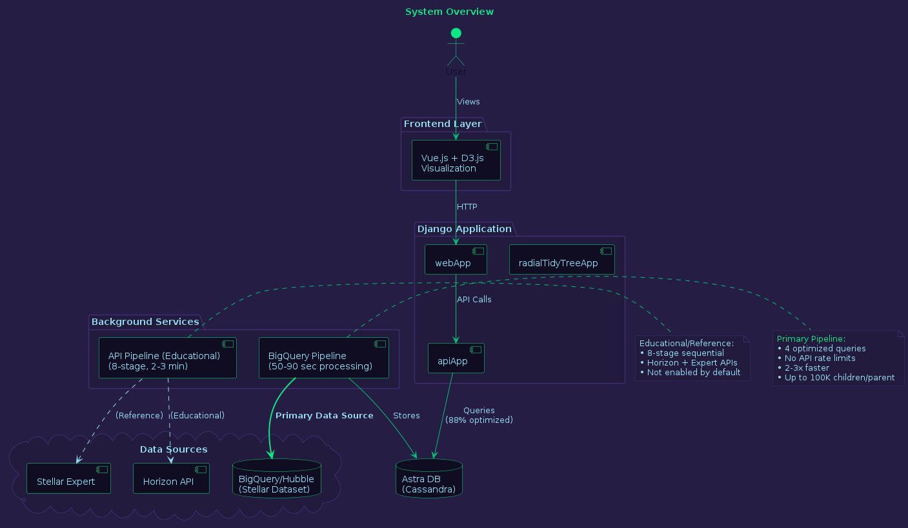
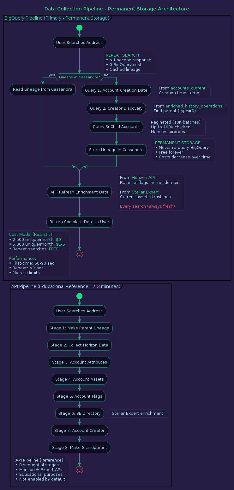
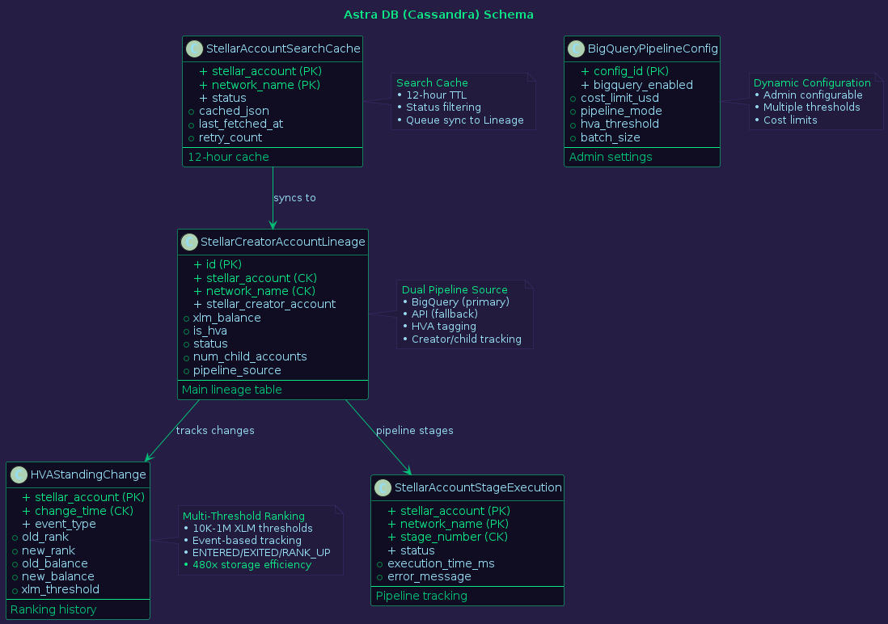

# StellarMapWeb

StellarMapWeb is a Django application designed to visualize Stellar blockchain lineage data. It collects account creation relationships from Stellar's BigQuery/Hubble dataset (primary) and Horizon API/Stellar Expert (educational reference), stores this data in Astra DB (Cassandra), and then renders it as interactive D3.js radial tree diagrams. The project aims to provide users with a clear, interactive "family tree" view of how Stellar accounts are created and interconnected, offering insights into the network's structure and activity. The application features a high-performance BigQuery pipeline capable of processing an address in 50-90 seconds (2-3x faster than API approach), discovering up to 100,000 child accounts per parent, robust address validation, and a user-friendly interface with real-time pending account tracking and graceful error handling.

## Quick Start

### Replit Deployment
1. Create Python Repl and upload files
2. Install dependencies: `pip install -r requirements.txt`
3. Configure Secrets:
   - `DJANGO_SECRET_KEY` (generate secure key)
   - `DEBUG=True` (development only)
   - `ASTRA_DB_TOKEN`, `CASSANDRA_DB_NAME`, `CASSANDRA_KEYSPACE`
   - `SENTRY_DSN` (optional)
4. Run: Auto-runs migrate/server via `.replit` config
5. Access via Webview and input Stellar address

### Docker Deployment (Recommended for Local Dev)
```bash
# Copy environment template
cp .env.example .env

# Edit .env and set your DJANGO_SECRET_KEY (generate a secure one)
# For local dev, USE_SQLITE=True is already set
# Add GOOGLE_APPLICATION_CREDENTIALS_JSON for BigQuery access

# Start services (Django server + BigQuery pipeline)
docker-compose up -d

# View logs
docker-compose logs -f

# Stop services
docker-compose down
```

Access the application at `http://localhost:5000`

### Local Development (Without Docker)
```bash
# Set environment variables
export DJANGO_SECRET_KEY="your-secret-key"
export DEBUG="True"
export USE_SQLITE="True"

# Optional: For production Cassandra/Astra DB
# export ASTRA_DB_TOKEN="your-token"
# export CASSANDRA_DB_NAME="your-db-name"
# export CASSANDRA_KEYSPACE="your-keyspace"

# Install and run
pip install -r requirements.txt
python manage.py migrate
python manage.py runserver 0.0.0.0:5000
```

### Run Tests
```bash
python manage.py test
```

---

## Production Deployment Options

### Option 1: Hybrid Architecture (Recommended for Production)

Cost-effective hybrid deployment separating web app from background jobs:

**Architecture:**
```
Cloudflare (DDoS) → Replit Autoscale (Web App) → Astra DB
                          ↓
                    Linode VPS (Cron Jobs)
```

**Components:**
- **Replit Autoscale**: Web application (auto-scales 0 to N based on traffic)
- **Linode VPS**: BigQuery cron jobs (reliable 24/7 execution)
- **Cloudflare**: DDoS protection + CDN (free tier)
- **Astra DB**: Shared database for both services

**Setup:**
1. **Deploy web app to Replit Autoscale**:
   - Uses existing `.replit` deployment config
   - Auto-scales based on traffic
   - Scales to zero when idle (saves costs)

2. **Deploy cron jobs to Linode VPS**:
   ```bash
   # On Linode VPS
   docker compose -f docker-compose.cron.yml up -d
   ```
   - Runs BigQuery pipeline every hour
   - Always-on for reliable processing

**Total Cost: $10-32/month**
- Linode: $5-12/month (Nanode 1GB or Linode 2GB)
- Replit: ~$5-15/month (pay-per-use, scales to zero)
- Cloudflare: $0 (free tier)
- Astra DB: $0 (free tier, up to 80GB)
- BigQuery: $0-5/month (permanent storage model)

**See:** [LINODE_DEPLOYMENT.md](./LINODE_DEPLOYMENT.md) for complete setup guide

### Option 2: Self-Hosted with Load Balancing

Full production stack with Nginx load balancer and Redis:

```bash
# For multi-instance production with Redis
docker compose -f docker-compose.redis.yml up -d

# For single instance testing
docker compose -f docker-compose.nginx.yml up -d
```

**Features:**
- Nginx load balancer across 2+ Django instances
- Redis for cluster-wide rate limiting
- Health checks and monitoring
- Cloudflare integration

**See:** [CLOUDFLARE_SETUP.md](./CLOUDFLARE_SETUP.md) for complete setup guide

### Option 3: Simple Docker Deployment

Single-instance deployment for small-scale production:

```bash
docker-compose up -d
```

Includes web server and BigQuery cron job in one stack.

---

## System Architecture

### Architecture Diagrams

#### 1. System Overview


#### 2. Data Pipeline (BigQuery & API Approaches)


#### 3. Database Schema


#### 4. Frontend & API Layer


#### 5. Monitoring System


---

### Framework and Structure
- **Django 4.2.7** with a multi-app architecture:
  - `apiApp`: API and data management
  - `webApp`: User interface
  - `radialTidyTreeApp`: Visualization components

### Database Architecture
- **Primary Storage**: Astra DB (DataStax Cassandra) for production using `django-cassandra-engine`. SQLite for local development.
- **Database Routing**: Custom `DatabaseAppsRouter` for directing apps to appropriate databases.
- **ORM**: Combines Django ORM with direct Cassandra integration, explicitly using `__table_name__` for Cassandra models.
- **Schema Design**: Cassandra models use composite primary keys and clustering keys for efficient querying and include `created_at` and `updated_at` timestamps.
- **Horizon JSON Data Storage**: Stores Horizon API responses directly in Cassandra TEXT columns (`horizon_accounts_json`, `horizon_operations_json`, `horizon_effects_json`) on the `StellarCreatorAccountLineage` model. This approach provides simpler, more reliable data persistence using existing CQL credentials, replacing the previous REST API Document Collections approach that was incompatible with Classic Cassandra databases.
- **Caching**: 12-hour caching strategy for Stellar address searches using `StellarAccountSearchCache` to minimize API calls.

### Data Collection Pipeline

#### BigQuery Pipeline (Primary Method - Permanent Storage Architecture)

**Architectural Principle:** BigQuery is ONLY queried for accounts never searched before. Once stored, lineage data is permanent in Cassandra.

**Data Flow:**
```
First-Time Search → BigQuery (lineage) → Cassandra (permanent storage)
                                               ↓
Repeat Search ──────────────────────────────→ Cassandra (0 BigQuery cost)
                                               ↓
Enrichment Refresh ──────────────────────→ Horizon/Stellar Expert APIs (free)
```

**Performance:**
- **First-Time Searches**: 50-90 seconds (BigQuery + Cassandra storage)
- **Repeat Searches**: <1 second (Cassandra cache, 0 BigQuery cost)
- **Processing Speed**: 2-3x faster than API approach for first-time searches
- **No Rate Limits**: Direct BigQuery access eliminates API throttling concerns

**BigQuery Queries (First-Time Only):**
  1. **Account Creation Date**: From `accounts_current` table
  2. **Creator Discovery**: Find parent account from `enriched_history_operations` (type=0)
  3. **Child Accounts**: Discover all child accounts created (paginated up to 100,000)

**API Queries (Every Search):**
  - **Account Details**: Balance, flags, home_domain from Horizon API (always fresh)
  - **Asset Holdings**: Current trustlines from Stellar Expert API (always fresh)

**Cost Efficiency:**
- **Free Tier Coverage**: Up to 2,500-3,900 unique accounts/month (1 TB free tier)
- **Enterprise Scale**: 5,000 unique accounts/month = $1-5/month
- **Typical Deployment**: $0/month (within free tier indefinitely)
- **Key Insight**: Costs DECREASE over time as database grows (more cached accounts)

**Comprehensive Discovery:**
- Pagination with 10,000-row batches, deduplication by account address
- Handles transactions creating multiple accounts (airdrops)
- Up to 100,000 child accounts per parent

#### BigQuery Pipeline Command
```bash
# Process up to 100 accounts
python manage.py bigquery_pipeline --limit 100

# Reset all accounts to PENDING
python manage.py bigquery_pipeline --reset
```

#### API-Based Pipeline (Educational Reference)
- **Alternative Approach**: 8-stage sequential pipeline using Horizon API and Stellar Expert.
- **Processing Time**: 2-3 minutes per account.
- **Use Case**: Educational purposes, API-based data collection demonstrations.
- **Not Enabled**: Available in codebase (`run_cron_jobs.py`) but not configured to run by default.
- **8 Sequential Stages**:
  1. Make Parent Lineage
  2. Collect Horizon Data
  3. Collect Account Attributes
  4. Collect Account Assets
  5. Collect Account Flags
  6. Collect SE Directory
  7. Collect Account Creator
  8. Make Grandparent Lineage

#### Workflow Management
- **Comprehensive Tracking**: 18 status constants for tracking data collection:
  - `PENDING`, `IN_PROGRESS`, `DONE`, `RE_INQUIRY`
  - `FAILED`, `INVALID_HORIZON_STELLAR_ADDRESS` (terminal statuses)
  - Various stage-specific statuses

#### BigQuery Integration
- **Dataset**: `crypto-stellar.crypto_stellar_dbt` (Stellar Hubble public dataset)
- **Key Tables**:
  - `accounts_current`: Current account state (balance, flags, thresholds)
  - `trust_lines_current`: Asset holdings and trustlines
  - `enriched_history_operations`: Complete blockchain history (operations, transactions)
- **Authentication**: Google Cloud service account with BigQuery access (GOOGLE_APPLICATION_CREDENTIALS_JSON)
- **Creator Attribution**: Queries `create_account` operations (type=0) for funder/creator identification.
- **Child Discovery**: Discovers all accounts where parent is the funder with proper pagination.

#### API Integration & Reliability (API Pipeline)
- **APIs Used**: Horizon API and Stellar Expert with asynchronous interactions (`async/await`).
- **Retry Logic**: `Tenacity` library for robust API calls with exponential backoff.
- **Validation**: Horizon API 404 validation catches invalid addresses.
- **Terminal Status**: `INVALID_HORIZON_STELLAR_ADDRESS` and `FAILED` are terminal statuses.

### Frontend Architecture

#### Templating & Visualization
- **Templating**: Django templates enhanced with Vue.js components for interactivity.
- **Visualization**: D3.js for interactive radial tree diagrams.
- **Responsive Design**: Bootstrap-based interface.

#### User Experience Features
- **Error Handling**: Graceful error handling for invalid Stellar addresses.
- **Default Display**: Default display of pending accounts.
- **Cache Prevention**: Browser caching prevented using `Cache-Control` headers.

#### Pending Accounts UI
- **Real-time Display**: Vue.js watcher displays all `PENDING`/`IN_PROGRESS`/`RE_INQUIRY` accounts from `StellarAccountSearchCache` and `StellarCreatorAccountLineage` tables.
- **Auto-Refresh**: Vue.js polling system refreshes Pending Accounts tab every 5 seconds via `/api/pending-accounts/` endpoint.
- **Lifecycle Management**: Immediate initial fetch and proper cleanup on component destruction.

#### Stages Monitoring
- **Real-time Progress**: Pipeline progress tracking showing execution time, status, and errors for each of the 8 stages per address.
- **API Endpoint**: `/api/stage-executions/` endpoint with 5-second auto-refresh in dedicated Stages tab.
- **Stage Details**:
  - Stage 1: Make Parent Lineage
  - Stage 2: Collect Horizon Data
  - Stages 3-8: Lineage enrichment

#### Immediate Stage Initialization
- **Instant Creation**: All 8 pipeline stages are created instantly when a new address is searched.
- **Immediate Visibility**: Stages appear immediately in the Stages tab with PENDING status before processing begins.
- **Helper Functions**: `initialize_stage_executions()` and `update_stage_execution()` ensure consistent stage lifecycle management with no duplicates.

#### Interactive JSON Viewer
- **Clickable Interface**: Stages tab includes clickable JSON icon in Actions column.
- **Modal Display**: Opens modal popup displaying complete stage execution data.
- **Formatted JSON**: Syntax-highlighted JSON with dark theme styling using highlight.js.
- **Graceful Fallback**: Falls back to plain JSON if highlight.js unavailable.

---

## Security and Monitoring

### Testing Framework
- **Comprehensive Test Suite**: 122+ tests across 8 test modules covering security, functionality, and monitoring.

#### Test Modules
1. **test_validator_security.py**: 16 tests for enhanced validator with ValidationError enforcement
2. **test_security_injection_prevention.py**: NoSQL injection, XSS, command injection, path traversal
3. **test_security_api_validation.py**: Stellar address validation, external API data validation, query parameters
4. **test_security_configuration.py**: Secrets management, environment variables, secure defaults
5. **test_security_frontend.py**: XSS prevention, CSRF protection, clickjacking prevention
6. **test_failed_status_handling.py**: Terminal status exclusion from cron processing
7. **test_stage_executions.py**: 17 tests for pipeline stage monitoring (model validation, API security, stage tracking, cron integration)
8. **test_stage_json_viewer.py**: 15 tests for interactive JSON viewer (template rendering, API data integrity, JSON formatting, security)

#### Test Coverage Areas
- ValidationError enforcement for malicious input (shell chars, path traversal, null bytes, invalid checksums)
- Injection Prevention (NoSQL injection, XSS, command injection, path traversal)
- API Input Validation (Stellar addresses, external API data, query parameters)
- Configuration Security (secrets management, environment variables, secure defaults)
- Frontend Security (XSS prevention, CSRF protection, clickjacking prevention)
- Terminal Status Handling (FAILED, INVALID_HORIZON_STELLAR_ADDRESS exclusion from recovery)

### Input Validation & Injection Prevention

#### Enhanced Validator with ValidationError Enforcement
- **Dual Mode Operation**: `StellarMapValidatorHelpers.validate_stellar_account_address()` supports:
  - `raise_exception=False` (default): Returns True/False for backwards compatibility
  - `raise_exception=True`: Raises Django ValidationError with descriptive messages for strict enforcement
- **Multi-layer Protection**: Prevents malicious data from proceeding past validation layer

#### Multi-Layer Address Validation
- **Cryptographic Checks**: Stellar SDK regex and cryptographic checks at view/model/validator layers
- **Format Validation**: 56-character length enforcement with 'G' prefix requirement
- **Character Whitelist**: Base32 character whitelist (A-Z, 2-7) - prevents special characters, null bytes, unicode attacks
- **Network Validation**: Horizon API 404 validation catches invalid addresses that don't exist on the network
- **Terminal Status**: Invalid addresses marked with `INVALID_HORIZON_STELLAR_ADDRESS` terminal status

#### NoSQL Injection Protection
- Cassandra query parameter sanitization and validation
- Status field whitelist validation (prevents status injection)
- Numeric field bounds checking (prevents overflow attacks)
- Query length limits to prevent buffer overflow

#### XSS Prevention
- Django template auto-escaping enabled globally
- Vue.js text interpolation (auto-escaped)
- No v-html usage with user input
- API response escaping and sanitization
- Error messages sanitized to prevent reflection attacks

#### Command Injection Prevention
- Shell character blacklist in validators (`;`, `|`, `&`, `` ` ``, `$`, `(`, `)`)
- No shell execution in validation or processing code
- External API command parameter whitelisting

#### Path Traversal Protection
- Path traversal pattern detection (`../`, `..\\`, URL-encoded variants)
- File path sanitization in all file operations

### API Security

#### Protection Mechanisms
- **CSRF Protection**: Django CSRF middleware enabled for all state-changing operations
- **Content-Type Validation**: API validates Content-Type headers and rejects invalid types
- **Query Parameter Security**:
  - Length limits on all query parameters
  - Special character handling and sanitization
  - URL encoding validation

#### HTTP Security Headers
- **X-Frame-Options**: DENY/SAMEORIGIN (clickjacking prevention)
- **X-Content-Type-Options**: nosniff (MIME sniffing prevention)
- **Referrer-Policy**: Configured
- **Content-Security-Policy (CSP)**: For inline script prevention
- **Strict-Transport-Security (HSTS)**: In production

### External API Data Validation

#### Horizon API Response Validation
- Operation type whitelist (24 valid Stellar operation types)
- Numeric field bounds checking (balance, timestamp validation)
- Timestamp sanity checks (prevents time-based attacks)
- JSON schema validation before processing

#### Stellar Expert Data Sanitization
- Domain validation (prevents javascript:, file://, data: URIs)
- HTML/script tag stripping from names and descriptions
- Tag array sanitization

### Configuration Security

#### Secrets Management
- All secrets from environment variables via Replit Secrets
- `python-decouple` for typed environment variable loading
- No hardcoded credentials in source code
- Django SECRET_KEY from environment (50+ characters, not default values)
- Cassandra/Astra DB credentials from ASTRA_DB_TOKEN environment variable

#### Secure Defaults
- DEBUG=False in production
- ALLOWED_HOSTS configured (not wildcard in production)
- SESSION_COOKIE_SECURE=True (HTTPS-only cookies)
- SESSION_COOKIE_HTTPONLY=True (prevents JS access)
- CSRF_COOKIE_SECURE=True in production
- SECURE_SSL_REDIRECT=True in production

#### Database Security
- Cassandra connections use SSL/TLS
- Connection encryption enforced
- No database credentials in source code

### Frontend Security

#### Template Security
- Django auto-escaping enabled for all templates
- |safe filter never used with user input
- json_script filter for safe JSON embedding

#### Vue.js Security
- Text interpolation {{ }} used (auto-escaped)
- v-bind for dynamic attributes (prevents attribute injection)
- No v-html with user-provided content
- Event handlers call methods, not eval

#### Session Security
- Secure cookie flags set
- HTTP-only cookies prevent XSS theft
- SameSite cookie attribute configured

### Environment Configuration & Monitoring
- **Environment Configuration**: `Decouple` library for secure environment variable management with type validation.
- **Error Tracking**: Sentry integration for error monitoring (sensitive data filtered from logs).
- **HTTPS Enforcement**: Production settings enforce SSL/TLS with HSTS headers.
- **Security Test Automation**: Continuous security testing in CI/CD pipeline.

---

## External Dependencies

### Blockchain APIs
- **Horizon API**: Official Stellar network API for core data
- **Stellar Expert**: Third-party service for enhanced Stellar account information

### Database Services
- **Astra DB**: DataStax managed Cassandra service for production
- **Cassandra**: Distributed NoSQL database

### Monitoring and Development
- **Sentry**: Error tracking and performance monitoring
- **Replit**: Cloud development and deployment platform

### Key Libraries
- **stellar-sdk**: Python SDK for Stellar blockchain
- **django-cassandra-engine**: Django integration for Cassandra
- **google-cloud-bigquery**: Google BigQuery client for Stellar Hubble dataset queries
- **tenacity**: Retry library for robust operations
- **pandas**: Data manipulation
- **requests**: HTTP client
- **aiohttp**: Asynchronous HTTP client

### Frontend Dependencies
- **D3.js**: Data visualization library
- **Vue.js**: JavaScript framework for interactive UI
- **Bootstrap**: CSS framework for responsive design
- **jQuery**: JavaScript library
- **highlight.js**: Syntax highlighting for JSON viewer

---

## License

This project is open source and available for educational and research purposes.
