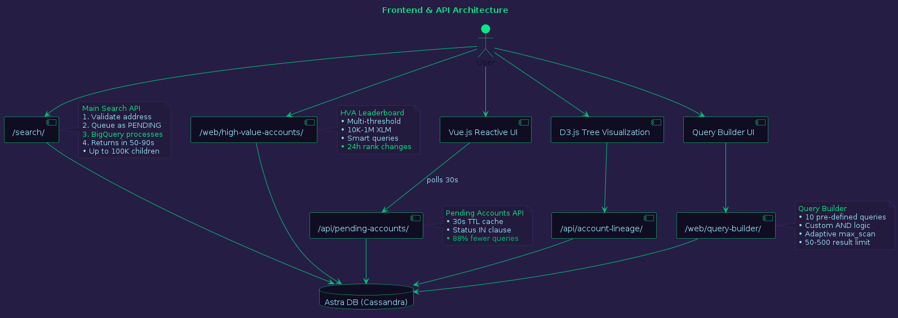
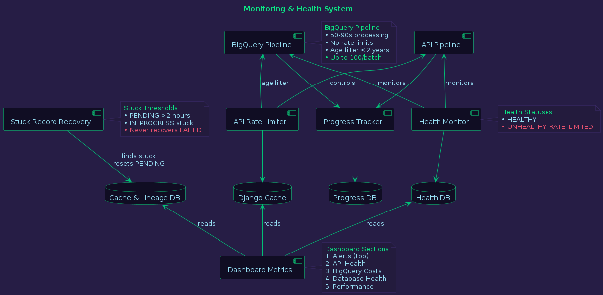
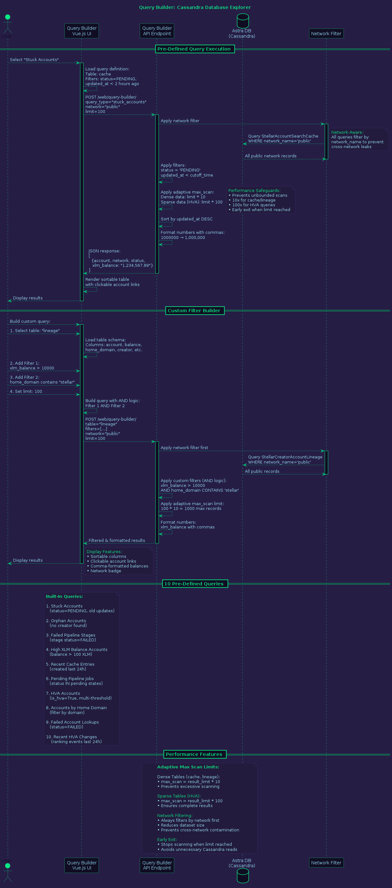

# StellarMapWeb - Technical Architecture Documentation

**Target Audience:** Developers, System Architects, DevOps Engineers

**Last Updated:** October 23, 2025

---

## Table of Contents

1. [System Overview](#1-system-overview)
2. [Data Pipeline Architecture](#2-data-pipeline-architecture)
3. [Database Schema](#3-database-schema)
4. [Frontend & API Layer](#4-frontend--api-layer)
5. [Monitoring & Health System](#5-monitoring--health-system)
6. [Hybrid Production Architecture](#6-hybrid-production-architecture)
7. [HVA Ranking System](#7-hva-ranking-system)
8. [Query Builder Architecture](#8-query-builder-architecture)
9. [Dual-Pipeline Architecture](#9-dual-pipeline-architecture)
10. [Technology Stack](#technology-stack)
11. [Performance Optimizations](#performance-optimizations)
12. [Security Implementation](#security-implementation)

---

## 1. System Overview

### High-Level Architecture


### Components

#### **Frontend Layer**
- **Vue.js**: Real-time reactive UI for pending accounts and pipeline progress
- **D3.js**: Interactive radial and tidy tree visualizations with zoom/pan controls
- **Bootstrap**: Responsive design framework

#### **Django Application (Multi-App Architecture)**
- **webApp**: User-facing web interface and HVA leaderboard
- **apiApp**: API endpoints, data management, and pipeline orchestration
- **radialTidyTreeApp**: Visualization components and D3.js integration

#### **Data Sources**
- **Google BigQuery**: Stellar Hubble dataset for historical lineage data
- **Horizon API**: Real-time Stellar account data and balances
- **Stellar Expert**: Additional account metadata and assets

#### **Storage**
- **Astra DB (Cassandra)**: Production database with multi-region support
- **SQLite**: Local development database
- **Redis** (optional): Multi-instance rate limiting and caching

---

## 2. Data Pipeline Architecture

### BigQuery Pipeline (Primary - Permanent Storage)


#### **Design Philosophy**
> **"Query Once, Store Forever"** - BigQuery is ONLY queried for first-time searches. All subsequent requests serve from Cassandra cache at zero BigQuery cost.

#### **Pipeline Flow**

**First-Time Search (50-90 seconds):**
1. **Account Creation Date**: Query `accounts_current` table
2. **Creator Discovery**: Query `enriched_history_operations` for type=0 (create_account)
3. **Child Accounts**: Paginated queries (10K batches, up to 100K children)
4. **Permanent Storage**: Store lineage in Cassandra
5. **API Enrichment**: Fetch current balances and metadata from Horizon/Expert

**Repeat Search (<1 second):**
1. Read lineage from Cassandra (0 BigQuery cost)
2. Refresh enrichment data via free APIs
3. Return complete data to user

#### **Cost Model**
- **2,500 unique searches/month**: $0 (within free tier)
- **5,000 unique searches/month**: $1-5
- **Repeat searches**: FREE (cached in Cassandra)
- **Data scanned per search**: ~265 MB

#### **Performance Optimizations**
- **Singleton BigQuery Client**: Avoids expensive re-initialization
- **CTE-Based Queries**: Consolidated query structure reduces round trips
- **Age-Based Filtering**: Only processes accounts <2 years old for instant queries
- **BigQueryCostGuard**: Enforces cost and size limits per query
- **Pagination**: Handles airdrop accounts with 100K+ children efficiently

#### **API Pipeline (Educational Reference)**
Alternative 8-stage pipeline using Horizon API and Stellar Expert:
- Stage 1: Make Parent Lineage
- Stage 2: Collect Horizon Data
- Stage 3-5: Account Attributes, Assets, Flags
- Stage 6: Stellar Expert Directory
- Stage 7-8: Creator Discovery, Grandparent Lineage

*Note: API pipeline is for educational purposes; BigQuery pipeline is recommended for production.*

---

## 3. Database Schema

### Astra DB (Cassandra) Schema


#### **Core Tables**

##### **StellarAccountSearchCache**
**Purpose:** 12-hour caching for searched accounts

```python
PRIMARY KEY: (stellar_account, network_name)
```

| Column | Type | Description |
|--------|------|-------------|
| stellar_account | TEXT | Stellar public key (PK) |
| network_name | TEXT | 'public' or 'testnet' (PK) |
| status | TEXT | PENDING, IN_PROGRESS, SUCCESS, FAILED, etc. |
| cached_json | TEXT | JSON response from pipeline |
| last_fetched_at | TIMESTAMP | Last successful fetch |
| retry_count | INT | Failed attempt counter |
| created_at | TIMESTAMP | Record creation |
| updated_at | TIMESTAMP | Last modification |

**Optimized Query:**
```python
StellarAccountSearchCache.objects.filter(
    status__in=['PENDING', 'IN_PROGRESS', 'RE_INQUIRY']
).limit(100)
```

##### **StellarCreatorAccountLineage**
**Purpose:** Permanent lineage storage with enrichment data

```python
PRIMARY KEY: (id)
CLUSTERING KEYS: (stellar_account, network_name, created_at)
```

| Column | Type | Description |
|--------|------|-------------|
| id | UUID | Primary key |
| stellar_account | TEXT | Account address (CK) |
| network_name | TEXT | Network identifier (CK) |
| stellar_creator_account | TEXT | Parent account address |
| stellar_account_created_at | TIMESTAMP | Account creation time |
| xlm_balance | DECIMAL | Current XLM balance |
| home_domain | TEXT | Account home domain |
| is_hva | BOOLEAN | High Value Account flag |
| tags | LIST<TEXT> | Account tags (HVA, etc.) |
| num_child_accounts | INT | Number of children created |
| status | TEXT | Processing status |
| retry_count | INT | Retry attempts |

**Data Source:** BigQuery (lineage) + Horizon/Expert APIs (enrichment)

##### **StellarAccountStageExecution**
**Purpose:** Pipeline stage tracking

```python
PRIMARY KEY: (stellar_account, network_name, created_at)
CLUSTERING KEY: (stage_number)
```

Tracks execution time, status, and errors for each pipeline stage.

##### **ManagementCronHealth**
**Purpose:** Health monitoring for both pipelines

```python
PRIMARY KEY: (id, created_at)
CLUSTERING KEY: (cron_name)
```

**Health Statuses:**
- `HEALTHY`: Normal operation
- `UNHEALTHY_RATE_LIMITED`: API rate limits exceeded

##### **HVAStandingChange**
**Purpose:** Multi-threshold ranking change events

```python
PRIMARY KEY: (stellar_account)
CLUSTERING KEY: (change_time)
```

| Column | Type | Description |
|--------|------|-------------|
| stellar_account | TEXT | Account address (PK) |
| change_time | TIMEUUID | Event timestamp (CK) |
| event_type | TEXT | ENTERED, EXITED, RANK_UP, RANK_DOWN |
| old_rank | INT | Previous rank |
| new_rank | INT | New rank |
| old_balance | DECIMAL | Previous balance |
| new_balance | DECIMAL | New balance |
| xlm_threshold | BIGINT | Threshold level (10K, 50K, etc.) |
| network_name | TEXT | Network filter |
| rank_change | INT | Calculated rank delta |
| balance_change_pct | DECIMAL | Percentage change |

**Storage Efficiency:** Event-based tracking achieves **480x storage reduction** vs. snapshot approach.

##### **BigQueryPipelineConfig**
**Purpose:** Admin-configurable pipeline settings

```python
PRIMARY KEY: (config_id)
```

| Column | Type | Description |
|--------|------|-------------|
| bigquery_enabled | BOOLEAN | Enable/disable BigQuery pipeline |
| cost_limit_usd | DECIMAL | Per-query cost limit |
| size_limit_mb | BIGINT | Data scan size limit |
| pipeline_mode | TEXT | BIGQUERY_ONLY, BIGQUERY_WITH_API_FALLBACK, API_ONLY |
| hva_threshold | BIGINT | Default HVA threshold (100,000 XLM) |
| hva_supported_thresholds | TEXT | Comma-separated thresholds (10K, 50K, 100K, etc.) |
| batch_size | INT | Accounts processed per batch |
| cache_ttl_hours | INT | Cache time-to-live |

---

## 4. Frontend & API Layer

### API Architecture



#### **API Endpoints**

##### **1. Pending Accounts API** (`/api/pending-accounts/`)
**Purpose:** Real-time pipeline status for Vue.js dashboard

**Caching:** 30-second TTL  
**Polling Interval:** 30 seconds (with Page Visibility API)

**Optimized Query Strategy:**
```python
# Query 1: Search cache
pending_cache = StellarAccountSearchCache.objects.filter(
    status__in=['PENDING', 'IN_PROGRESS', 'RE_INQUIRY']
).limit(100)

# Query 2: Lineage records
pending_lineage = StellarCreatorAccountLineage.objects.filter(
    status__in=['PENDING', 'IN_PROGRESS']
).limit(100)
```

**Result:** 88% reduction in query count (from 200 to 2 queries)

##### **2. Stage Executions API** (`/api/stage-executions/`)
**Purpose:** Real-time pipeline stage tracking

**Polling Interval:** 5 seconds  
**Features:**
- Interactive JSON viewer
- Execution time tracking
- Error message display
- Immediate initialization

##### **3. Search API** (`/search/`)
**Purpose:** Main search endpoint with pipeline initiation

**Flow:**
1. Validate Stellar address format
2. Queue as PENDING in StellarAccountSearchCache
3. BigQuery pipeline processes in background (50-90s)
4. Return cached result or redirect to tree view

**Capabilities:**
- Up to 100K children per parent account
- Network-aware (public/testnet)
- Comma-formatted balances

##### **4. High Value Accounts API** (`/web/high-value-accounts/`)
**Purpose:** Multi-threshold HVA leaderboard

**Smart Query Strategy:**

```python
# High thresholds (≥ default): Use is_hva filter
if threshold >= default_threshold:
    accounts = StellarCreatorAccountLineage.objects.filter(
        is_hva=True,
        network_name=network
    ).allow_filtering()

# Low thresholds (< default): Network filter only
else:
    accounts = StellarCreatorAccountLineage.objects.filter(
        network_name=network
    )
    # Apply threshold in-memory
```

**Features:**
- Threshold dropdown selector (10K to 1M XLM)
- 24-hour rank change indicators
- Partition-key lookups for ranking history
- Clickable account links to search page
- Comma-formatted balances (e.g., "2,483,571.75 XLM")

##### **5. Query Builder API** (`/web/query-builder/`)
**Purpose:** Cassandra database exploration

**Pre-Defined Queries (10):**
1. Stuck Accounts
2. Orphan Accounts
3. Failed Pipeline Stages
4. High XLM Balance Accounts
5. Recent Cache Entries
6. Pending Pipeline Jobs
7. HVA Accounts
8. Accounts by Home Domain
9. Failed Account Lookups
10. Recent HVA Changes

**Custom Filter Builder:**
- Multi-column AND logic
- Network-aware filtering (always enforced)
- Adaptive `max_scan` limits:
  - Dense data (cache/lineage): `limit × 10`
  - Sparse data (HVA queries): `limit × 100`
- Sortable results with clickable account links
- Result limits: 50-500 records

##### **6. Account Lineage API** (`/api/account-lineage/`)
**Purpose:** Efficient tree hierarchy construction

**Optimization:** In-memory lineage sets prevent full table scans and Cassandra timeouts.

#### **Frontend Components**

##### **Vue.js Reactive UI**
- Real-time pending account display
- Auto-refresh with smart polling
- Network status indicators
- Progress tracking

##### **D3.js Visualizations**
- **Radial Tree**: Circular layout with smart tooltips
- **Tidy Tree**: Horizontal layout with adaptive line lengths
- **Zoom & Pan**: Mouse wheel zoom, drag pan, fit-to-window
- **Persistence**: Visualization mode saved in localStorage
- **Advanced Controls**: 3 spacing sliders for tidy tree customization

##### **Query Builder Vue Component**
- Dynamic filter builder
- Sortable results table
- Clickable account links
- Network badge display
- Comma-formatted numbers

---

## 5. Monitoring & Health System

### Monitoring Architecture



#### **Components**

##### **1. Health Monitor**
**Purpose:** Track pipeline health and API status

**Monitored Metrics:**
- Pipeline execution status (HEALTHY, UNHEALTHY_RATE_LIMITED)
- Execution time per pipeline run
- Error messages and stack traces
- BigQuery query performance

**Storage:** `ManagementCronHealth` table

##### **2. Stuck Record Recovery**
**Purpose:** Automatically recover stuck accounts

**Thresholds:**
- PENDING: >2 hours without progress
- IN_PROGRESS: Stalled processing

**Terminal Statuses (Never Recovered):**
- FAILED
- INVALID_HORIZON_STELLAR_ADDRESS

**Command:** `python manage.py clear_old_pending`

##### **3. Progress Tracker**
**Purpose:** Real-time pipeline stage monitoring

**Features:**
- Stage-by-stage execution tracking
- Execution time logging
- Error capture and display
- JSON viewer support
- UI integration via `/api/stage-executions/`

##### **4. API Rate Limiter**
**Purpose:** Prevent API abuse and rate limiting

**Implementation:**
- Django cache for cross-process metrics sharing
- Horizon API: 0.5s delay between calls
- Stellar Expert: 1.0s delay between calls
- Shared rate metrics across multiple workers

**Dashboard Integration:**
- API call counts
- Burst limit tracking
- Rate delay configurations
- Last call timestamps

##### **5. Dashboard Metrics**
**Purpose:** Centralized monitoring view

**Sections (Prioritized):**
1. **Alerts & Recommendations** (top priority)
2. **API Health Monitoring**
   - Call counts (comma-formatted)
   - Burst limits
   - Rate delays
   - Last call timestamps
3. **BigQuery Costs**
   - Monthly usage tracking
   - Cost projections
4. **Database Health**
   - Record counts per table
   - Stuck account detection
5. **Performance Metrics**
   - Average processing time
   - Success rate

**All numbers displayed with comma formatting for readability.**

#### **BigQuery Pipeline Monitoring**
- 50-90 second processing time
- No rate limits
- Age-based filtering (<2 years)
- Up to 100 accounts/batch
- Continuous operation

#### **API Pipeline Monitoring** (Educational)
- 8 sequential stages
- Rate limited: 0.5s Horizon, 1.0s Expert
- Not enabled by default

---

## 6. Hybrid Production Architecture

### Multi-Instance Deployment


#### **Architecture Overview**

**Components:**
- **Nginx Load Balancer**: Distributes traffic across Django instances
- **Multiple Django Workers**: Horizontal scaling for web requests
- **Redis**: Cluster-wide rate limiting and session management
- **Dedicated BigQuery Worker**: Isolated pipeline processing
- **Astra DB**: Multi-region Cassandra cluster

#### **Deployment Options**

##### **Option 1: Cloudflare + Linode (Recommended)**
- Cloudflare for SSL, caching, and DDoS protection
- Linode VM for Django application
- Docker Compose for orchestration
- Redis for multi-instance coordination

**See:** `CLOUDFLARE_SETUP.md` for complete guide

##### **Option 2: Docker Compose (Multi-Instance)**
```bash
docker compose -f docker-compose.redis.yml up -d
```

**Features:**
- Nginx load balancer across 2+ Django instances
- Redis for cluster-wide rate limiting
- Health checks and monitoring
- Automatic container restart

##### **Option 3: Simple Docker (Single Instance)**
```bash
docker-compose up -d
```

**Use Case:** Small-scale production, testing, development

#### **Health Checks**
- HTTP endpoint monitoring
- Database connection validation
- Redis connectivity checks
- BigQuery API availability

---

## 7. HVA Ranking System

### Multi-Threshold Ranking Architecture


#### **Design Philosophy**
> **Event-Based Tracking:** Only store CHANGES, not snapshots. Achieves **480x storage efficiency** compared to traditional snapshot approaches.

#### **Multi-Threshold Support**

**Admin-Configurable Thresholds (Default):**
- 10,000 XLM (10K)
- 50,000 XLM (50K)
- 100,000 XLM (100K) - Default
- 500,000 XLM (500K)
- 750,000 XLM (750K)
- 1,000,000 XLM (1M)

**Flexibility:** Admins can customize threshold list to any values (e.g., "25000,100000,5000000" for custom tiers)

#### **System Flow**

##### **Phase 1: Admin Configuration**
Admin configures HVA thresholds via Django Admin:

```python
BigQueryPipelineConfig.hva_supported_thresholds = "10000,50000,100000,500000,750000,1000000"
```

##### **Phase 2: Initial Backfill**
```bash
python manage.py recalculate_hva_rankings_multi
```

**Process:**
1. Retrieve supported thresholds from admin config
2. For each threshold:
   - Query accounts WHERE `xlm_balance >= threshold`
   - Calculate rankings (sorted by balance DESC)
   - Create `HVAStandingChange` event with `event_type=ENTERED`

##### **Phase 3: Continuous Tracking**
BigQuery pipeline monitors balance changes:

```python
for threshold in supported_thresholds:
    detect_and_record_change(account, old_balance, new_balance, threshold)
```

**Event Types:**
- `ENTERED`: Account crosses threshold (NULL → rank)
- `EXITED`: Account falls below threshold (rank → NULL)
- `RANK_UP`: Rank improves by ≥10 positions
- `RANK_DOWN`: Rank drops by ≥10 positions

**Storage per Event:**
```python
HVAStandingChange(
    stellar_account="GACJ...",
    change_time=TimeUUID.now(),
    event_type="RANK_UP",
    old_rank=25,
    new_rank=15,
    old_balance=2_450_000,
    new_balance=2_483_571,
    xlm_threshold=100_000,
    network_name="public",
    rank_change=10,
    balance_change_pct=1.37
)
```

##### **Phase 4: User Views Leaderboard**
```
GET /web/high-value-accounts/?threshold=100000
```

**Process:**
1. Display threshold dropdown selector
2. Smart query strategy:
   - High threshold (≥ default): Use `is_hva=True` filter
   - Low threshold (< default): Use network filter only, apply threshold in-memory
3. Sort by `xlm_balance DESC`
4. Format balances with commas: "2,483,571.75 XLM"
5. For each account (partition-key lookup):
   - Query `HVAStandingChange` WHERE `stellar_account=X` AND `xlm_threshold=selected` AND `network_name=Y` AND `created_at >= 24h ago`
   - Display rank change indicators: ↑5, ↓2, ⭐ NEW

**UI Features:**
- Clickable account addresses (open search page in new tab)
- 24-hour rank change badges
- Comma-formatted balances
- Network badges (public/testnet)

#### **Storage Efficiency Analysis**

**Traditional Snapshot Approach:**
- 6 thresholds × 1,000 accounts × 24 snapshots/day = **144,000 records/day**

**Event-Based Approach:**
- ~50 accounts with significant changes/day × 6 thresholds = **~300 events/day**

**Result: 480x reduction in storage requirements**

#### **Network-Aware Filtering**
All queries filter by `network_name` to prevent cross-network data leaks:
- Public network accounts never mix with testnet
- Ranking calculations isolated per network
- Change detection scoped to network

---

## 8. Query Builder Architecture

### Database Explorer System



#### **Design Goals**
1. Provide safe, performant access to Cassandra data
2. Support both pre-defined and custom queries
3. Prevent unbounded table scans
4. Maintain network isolation (public/testnet)

#### **Pre-Defined Queries (10)**

| # | Query Name | Table | Purpose |
|---|------------|-------|---------|
| 1 | Stuck Accounts | StellarAccountSearchCache | status=PENDING, updated_at >2h ago |
| 2 | Orphan Accounts | StellarCreatorAccountLineage | stellar_creator_account is NULL |
| 3 | Failed Pipeline Stages | StellarAccountStageExecution | status=FAILED |
| 4 | High XLM Balance | StellarCreatorAccountLineage | xlm_balance > 100 XLM |
| 5 | Recent Cache Entries | StellarAccountSearchCache | created_at within 24h |
| 6 | **Processing Accounts** | **Both Tables** | **Dual-table scan with stale detection** |
| 7 | HVA Accounts | StellarCreatorAccountLineage | is_hva=True, multi-threshold |
| 8 | Accounts by Domain | StellarCreatorAccountLineage | home_domain CONTAINS pattern |
| 9 | Failed Lookups | StellarAccountSearchCache | status=FAILED |
| 10 | Recent HVA Changes | HVAStandingChange | created_at within 24h |

#### **Enhanced Processing Accounts Query**

The **Processing Accounts** query (#6) has been enhanced with dual-table scanning and stale detection:

**Features:**
- Scans **both** Search Cache and Account Lineage tables
- Detects **stale processing** (accounts stuck in PROCESSING status for >30 minutes)
- Shows **table source** for each account (Search Cache vs Account Lineage)
- Marks stale records with **[STALE]** tag for easy identification

**Stale Detection Logic:**
```python
stale_threshold = datetime.utcnow() - timedelta(minutes=30)

# For Account Lineage: Use processing_started_at if available
if record.processing_started_at and record.processing_started_at < stale_threshold:
    mark_as_stale()

# For Search Cache: Use updated_at
if record.updated_at and record.updated_at < stale_threshold:
    mark_as_stale()
```

**Reset Stale Processing Data:**

Use the management command to reset stale accounts:
```bash
# Dry run (preview what will be reset)
python manage.py reset_stale_processing --minutes 30 --dry-run

# Live reset (default: 30 minutes, network: public)
python manage.py reset_stale_processing

# Custom threshold (60 minutes) on testnet
python manage.py reset_stale_processing --minutes 60 --network testnet
```

The command:
- Scans both Search Cache and Account Lineage tables
- Identifies accounts in PROCESSING status older than threshold
- Resets status to ERROR with descriptive message
- Clears `processing_started_at` field in Account Lineage
- Provides detailed summary of reset operations

#### **Custom Filter Builder**

**Features:**
- Multi-column filter support
- AND logic for combining filters
- Dynamic column visibility based on selected table
- Network-aware filtering (always enforced)

**Example Workflow:**
1. User selects table: "lineage"
2. UI loads table schema with available columns
3. User adds Filter 1: `xlm_balance > 10000`
4. User adds Filter 2: `home_domain contains "stellar"`
5. User sets limit: 100
6. System builds query with AND logic

**Backend Processing:**
```python
# Step 1: Apply network filter first (always)
accounts = StellarCreatorAccountLineage.objects.filter(
    network_name='public'
)

# Step 2: Apply custom filters (AND logic)
filtered = apply_filters(accounts, [
    {'column': 'xlm_balance', 'operator': '>', 'value': 10000},
    {'column': 'home_domain', 'operator': 'contains', 'value': 'stellar'}
])

# Step 3: Apply adaptive max_scan limit
max_scan = calculate_max_scan(table='lineage', limit=100)  # 100 * 10 = 1000

# Step 4: Format numbers with commas
for account in filtered:
    account.xlm_balance = format_with_commas(account.xlm_balance)
```

#### **Performance Safeguards**

##### **Adaptive Max Scan Limits**

**Purpose:** Prevent unbounded Cassandra scans while ensuring complete results

**Strategy:**

```python
def calculate_max_scan(table, limit):
    if table in ['cache', 'lineage']:
        # Dense data: 10x multiplier
        return limit * 10
    elif table == 'hva_changes':
        # Sparse data: 100x multiplier
        return limit * 100
    else:
        return limit * 10  # Default
```

**Rationale:**
- **Dense tables** (cache, lineage): Most records match filters, so 10x is sufficient
- **Sparse tables** (HVA changes): Fewer matching records, need 100x to ensure completeness

##### **Network Filtering**

**Enforcement Level:** Always applied at query level

```python
# BAD: Query without network filter
accounts = StellarCreatorAccountLineage.objects.all()

# GOOD: Network filter always first
accounts = StellarCreatorAccountLineage.objects.filter(
    network_name=network
)
```

**Benefits:**
- Reduces dataset size by ~50%
- Prevents cross-network data leakage
- Improves query performance

##### **Result Limits**

**Configurable Limits:**
- Minimum: 50 records
- Maximum: 500 records
- Default: 100 records

**Early Exit:** Query stops scanning when limit reached

#### **UI Features**

##### **Results Table**
- **Sortable Columns**: Click headers to sort ASC/DESC
- **Clickable Account Links**: Open search page in new tab
- **Comma-Formatted Numbers**: Balances display as "2,483,571.75 XLM"
- **Network Badges**: Visual indicator for public/testnet

##### **Filter Builder Interface**
- **Dynamic Column List**: Changes based on selected table
- **Operator Selection**: =, >, <, >=, <=, CONTAINS, etc.
- **Value Input**: Text/number input with validation
- **Add/Remove Filters**: Plus/minus buttons

---

## 9. Dual-Pipeline Architecture

### BigQuery + API Fallback System


#### **Overview**

**Migration Completed:** October 22, 2025

The dual-pipeline architecture combines the speed of BigQuery with the reliability of the API pipeline, providing an intelligent fallback system that tracks data origin and processing timestamps.

#### **Pipeline Components**

##### **BigQuery Pipeline (Fast Path)**

**Performance:**
- Processing Time: 50-90 seconds per account
- Child Account Discovery: Up to 100,000 children
- Cost: ~$0.35 per account
- Primary limitation: Budget constraints

**Features:**
- Singleton BigQuery client for efficiency
- Cost Guard enforces $0.71/query limit
- Comprehensive child account discovery
- Age-based filtering (<2 years for fast queries)

**Data Flow:**
1. Check Cost Guard budget → within limit?
2. Query Stellar Hubble dataset (BigQuery)
3. Discover child accounts (paginated)
4. Mark record with `pipeline_source='BIGQUERY'`
5. Store in Cassandra with timestamps

##### **API Pipeline (Reliable Fallback)**

**Performance:**
- Processing Time: 180-300 seconds per account
- Rate Limited: 71% of max (85 req/min Horizon, 35 req/min Expert)
- Cost: FREE (no direct costs)
- Primary use: Cost guard blocks or stuck records

**Features:**
- 8-stage processing workflow
- Tenacity retry logic with exponential backoff
- Stellar Expert fallback for creator discovery
- Percentage-based rate limiting

**Data Flow:**
1. Cost Guard blocks OR manual API processing
2. Fetch account data from Horizon API
3. Discover creator (Horizon → Stellar Expert fallback)
4. Mark record with `pipeline_source='API'` or `'BIGQUERY_WITH_API_FALLBACK'`
5. Store in Cassandra with timestamps

#### **Cassandra Schema Changes**

**Migration:** `cassandra_migration_dual_pipeline.cql` (Completed 2025-10-22)

**New Fields:**
```sql
ALTER TABLE stellar_creator_account_lineage 
ADD pipeline_source text;  -- BIGQUERY | API | BIGQUERY_WITH_API_FALLBACK

ALTER TABLE stellar_creator_account_lineage 
ADD last_pipeline_attempt timestamp;  -- Retry tracking

ALTER TABLE stellar_creator_account_lineage 
ADD processing_started_at timestamp;  -- Stuck detection
```

**Field Descriptions:**

| Field | Type | Purpose | Example Values |
|-------|------|---------|----------------|
| `pipeline_source` | TEXT | Tracks data origin | `BIGQUERY`, `API`, `BIGQUERY_WITH_API_FALLBACK` |
| `last_pipeline_attempt` | TIMESTAMP | Last processing attempt | `2025-10-22 22:30:15` |
| `processing_started_at` | TIMESTAMP | Detects stuck processing | `2025-10-22 22:25:00` |

#### **Pipeline Selection Logic**

**Hybrid Orchestrator Decision Tree:**

```
1. New account requested
2. Check BigQuery Cost Guard
   ├─ ✓ Within budget → Use BigQuery Pipeline
   │  └─ Mark: pipeline_source='BIGQUERY'
   │
   └─ ✗ Cost limit exceeded → Use API Pipeline
      └─ Mark: pipeline_source='BIGQUERY_WITH_API_FALLBACK'

3. Stuck/Failed Record Processing
   └─ Use API Pipeline (reliable fallback)
      └─ Mark: pipeline_source='API'
```

#### **Pipeline Execution Workflow**

**Updated:** October 23, 2025


##### **Lineage Graph Expansion**

Both pipelines now automatically expand the lineage graph by queueing discovered accounts:

**Creator Account Queueing:**
- When processing an account, its creator is extracted
- If creator doesn't exist in database → Create PENDING record
- If creator exists → Skip (no duplicate queueing)
- Next pipeline run processes the queued creator

**Child Account Queueing:**
- All child accounts discovered during processing are queued
- Each child checked for existence in database
- New children → Create PENDING records with parent relationship
- Existing children → Skip

**Queue Synchronizer Integration:**

**Pre-Processing (Search Cache → Lineage):**
```python
# Promote PENDING from Search Cache to Lineage table
sync_pending_to_lineage()
```

**Post-Processing (Lineage → Search Cache):**
```python
# Sync status back after successful processing
sync_status_back_to_cache()
# Maps: API_COMPLETE/BIGQUERY_COMPLETE → DONE_MAKE_PARENT_LINEAGE
```

**Execution Flow:**
1. **Queue Sync**: Promote PENDING accounts from Search Cache to Lineage
2. **Pipeline Processing**: Fetch and process account (BigQuery or API)
3. **Data Extraction**: Extract creator, children, balance, assets
4. **Database Update**: Store processed data in Lineage table
5. **Creator Queueing**: Check and queue creator account if new
6. **Child Queueing**: Check and queue all new child accounts
7. **Status Sync**: Update Search Cache with completion status
8. **Graph Expansion**: Newly queued accounts processed in next run

**Result:** Lineage count increases continuously as new accounts are discovered and queued for processing.

#### **Admin Configuration**

**BigQuery Pipeline Config** (`BigQueryPipelineConfig`)
- `pipeline_mode`: BIGQUERY_ONLY | API_ONLY | BIGQUERY_WITH_API_FALLBACK
- `cost_limit_usd`: Maximum cost per query (default: $0.71)
- `bigquery_enabled`: Enable/disable BigQuery pipeline

**API Rate Limiter Config** (`APIRateLimiterConfig`)
- `horizon_percentage`: % of max rate (default: 71% = 85 req/min)
- `expert_percentage`: % of max rate (default: 71% = 35 req/min)

#### **Dashboard Metrics**

**Dual-Pipeline Metrics Section:**

Displays breakdown by data source:
- **BigQuery Processed**: Total accounts via BigQuery
- **BigQuery + API Fallback**: Cost guard triggered, used API
- **API-Only Processed**: Direct API pipeline usage
- **Total Accounts**: Combined count
- **Last 24h Stats**: Recent processing by source

**Query Example:**
```python
# Get accounts by pipeline source
bigquery_accounts = StellarCreatorAccountLineage.objects.filter(
    pipeline_source='BIGQUERY'
).count()

api_accounts = StellarCreatorAccountLineage.objects.filter(
    pipeline_source='API'
).count()

fallback_accounts = StellarCreatorAccountLineage.objects.filter(
    pipeline_source='BIGQUERY_WITH_API_FALLBACK'
).count()
```

#### **Benefits**

**Cost Optimization:**
- BigQuery usage automatically throttled by Cost Guard
- Free API fallback when budget exceeded
- No data loss when switching pipelines

**Reliability:**
- Stuck BigQuery records can be reprocessed via API
- Dual tracking prevents duplicate processing
- Timestamp monitoring detects hung processes

**Performance:**
- Fast path (BigQuery) for most accounts
- Reliable fallback (API) for edge cases
- Source tracking enables performance analysis

**Operational Visibility:**
- Dashboard shows pipeline efficiency
- Compare BigQuery vs API performance
- Identify cost vs speed tradeoffs

---

## Technology Stack

### **Backend**
- **Django 5.0.2**: Web framework
- **Python 3.11**: Primary language
- **django-cassandra-engine**: Cassandra ORM integration
- **google-cloud-bigquery**: BigQuery client
- **stellar-sdk**: Stellar blockchain SDK
- **tenacity**: Retry logic with exponential backoff
- **aiohttp**: Async HTTP client
- **requests**: Synchronous HTTP client
- **pandas**: Data manipulation for BigQuery results

### **Frontend**
- **Vue.js 2.x**: Reactive UI components
- **D3.js 3.2.2**: Tree visualizations
- **Bootstrap 5**: Responsive design
- **jQuery**: DOM manipulation

### **Database**
- **Astra DB (Cassandra)**: Production database
- **SQLite**: Local development
- **Redis** (optional): Multi-instance caching

### **External APIs**
- **Google BigQuery**: Stellar Hubble dataset
- **Horizon API**: Real-time Stellar data
- **Stellar Expert**: Account enrichment

### **DevOps & Monitoring**
- **Docker & Docker Compose**: Containerization
- **Nginx**: Load balancing
- **Sentry**: Error tracking
- **GitHub Actions**: CI/CD pipeline
- **pytest**: Testing framework (180+ tests)

---

## Performance Optimizations

### **Database Layer**

#### **1. Cassandra Query Optimizations**
- **Partition-Key Lookups**: Used for HVA rank change queries (O(1) access)
- **IN Clause Batching**: Reduces queries from 200 to 2 for pending accounts
- **Clustering Key Ordering**: Optimized for time-series queries
- **Avoid Full Table Scans**: Network filters + is_hva flags

#### **2. BigQuery Optimizations**
- **Singleton Client Pattern**: Reuse expensive client initialization
- **CTE-Based Queries**: Reduce query count and cost
- **Age-Based Filtering**: Only process accounts <2 years old
- **Pagination**: Handle 100K+ child accounts efficiently
- **Cost Guards**: Enforce per-query limits ($0.01 max, 500MB max)

#### **3. Caching Strategy**
- **12-Hour Cache**: Stellar address searches
- **30-Second TTL**: Pending accounts API
- **localStorage**: Visualization mode preferences
- **Redis** (optional): Multi-instance shared cache

### **Frontend Layer**

#### **1. API Polling Optimization**
- **Page Visibility API**: Pause polling when tab inactive
- **30-Second Intervals**: Balanced real-time vs. server load
- **Conditional Rendering**: Only update Vue components when data changes

#### **2. D3.js Rendering**
- **Viewport-Aware Overflow**: Prevent text cutoff
- **Dynamic Line Lengths**: Adapt to child count
- **Smooth Transitions**: 300ms zoom, 750ms fit-to-window
- **Efficient Redraws**: Only re-render changed nodes

### **API Layer**

#### **1. Rate Limiting**
- **Cross-Process Metrics**: Django cache for shared state
- **Graduated Delays**: 0.5s Horizon, 1.0s Stellar Expert
- **Burst Protection**: Track call counts and enforce limits

#### **2. Response Optimization**
- **Comma Formatting**: Client-side where possible
- **Pagination**: Limit result sets (50-500 records)
- **Early Exit**: Stop processing when limits reached

---

## Security Implementation

### **Input Validation**
- **Multi-Layer Validation**: Frontend, API, and database levels
- **Stellar Address Format**: G-prefixed, 56-character validation
- **SQL Injection Prevention**: Parameterized queries, ORM usage
- **XSS Protection**: Template auto-escaping, CSP headers

### **API Security**
- **CSRF Protection**: Django tokens for state-changing requests
- **Content-Type Validation**: JSON-only for POST requests
- **Query Parameter Sanitization**: Whitelist allowed parameters
- **HTTP Security Headers**: X-Frame-Options, X-Content-Type-Options

### **Configuration Security**
- **Environment Variables**: All secrets in `.env` files
- **Separate Production Settings**: `production.py` with secure defaults
- **HTTPS Enforcement**: SSL redirect in production
- **Secret Key Rotation**: Django secret managed via environment

### **Database Security**
- **Network Isolation**: Public/testnet separation
- **Read-Only Query Builder**: No destructive operations allowed
- **Audit Logging**: Track all admin configuration changes

### **Monitoring & Error Tracking**
- **Sentry Integration**: Real-time error monitoring
- **Health Endpoints**: Public status checks
- **Security Auditing**: Regular `pip-audit` scans

---

## Development & Deployment

### **Local Development**
```bash
# Setup
python -m venv venv
source venv/bin/activate  # or venv\Scripts\activate on Windows
pip install -r requirements.txt

# Configure
cp .env.example .env
# Edit .env with your credentials

# Run migrations
python manage.py migrate

# Start server
python manage.py runserver
```

### **Testing**
```bash
# Run all tests
pytest

# Run specific markers
pytest -m unit          # Unit tests only
pytest -m integration   # Integration tests
pytest -m performance   # Performance tests

# With coverage
pytest --cov=. --cov-report=html
```

### **Docker Deployment**
```bash
# Single instance
docker-compose up -d

# Multi-instance with Redis
docker compose -f docker-compose.redis.yml up -d

# With Nginx load balancer
docker compose -f docker-compose.nginx.yml up -d
```

### **Production Deployment**
See detailed guides:
- **Cloudflare + Linode**: `CLOUDFLARE_SETUP.md`
- **Hybrid Architecture**: `LINODE_DEPLOYMENT.md`
- **HVA System**: `HVA_RANKING_SYSTEM.md`

---

## Additional Resources

### **Documentation**
- [User Guide](USER_GUIDE.md) - End-user documentation
- [HVA Ranking System](HVA_RANKING_SYSTEM.md) - Detailed HVA implementation
- [Cloudflare Setup](CLOUDFLARE_SETUP.md) - Production deployment guide
- [Testing Guide](TESTING.md) - pytest usage and best practices

### **External Links**
- [Stellar Horizon API Docs](https://developers.stellar.org/api/horizon)
- [Stellar Expert](https://stellar.expert/)
- [Google BigQuery Docs](https://cloud.google.com/bigquery/docs)
- [Astra DB Docs](https://docs.datastax.com/en/astra/home/astra.html)
- [Django-Cassandra-Engine](https://github.com/r4fek/django-cassandra-engine)

---

**Last Updated:** October 22, 2025  
**Version:** 2.0  
**Maintained By:** Development Team
