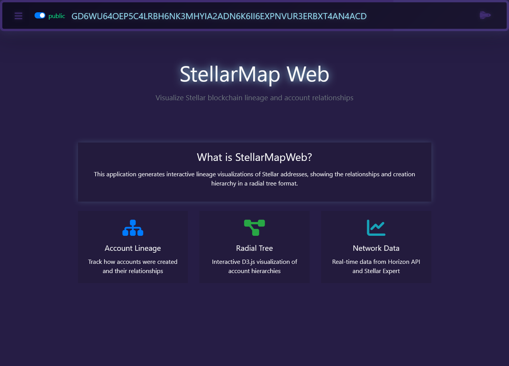
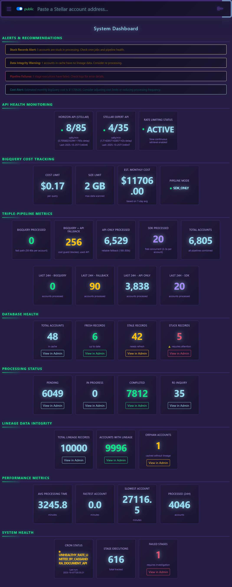
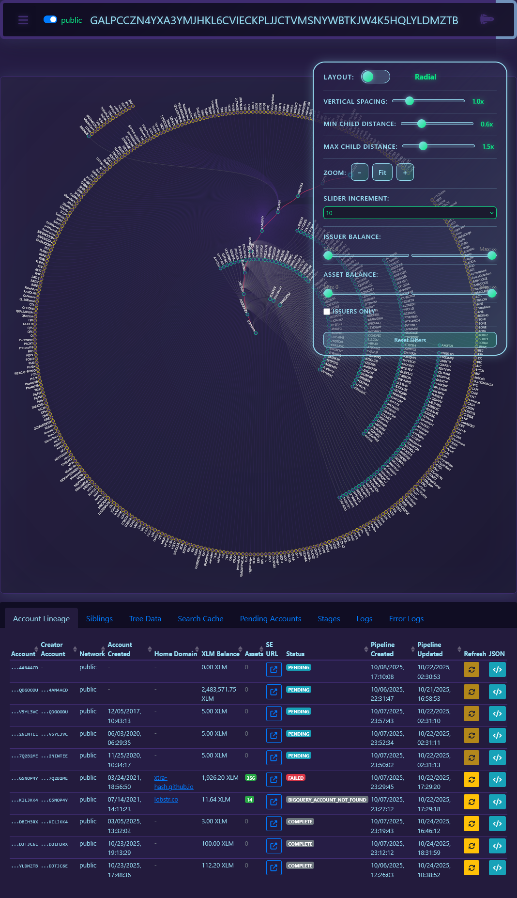
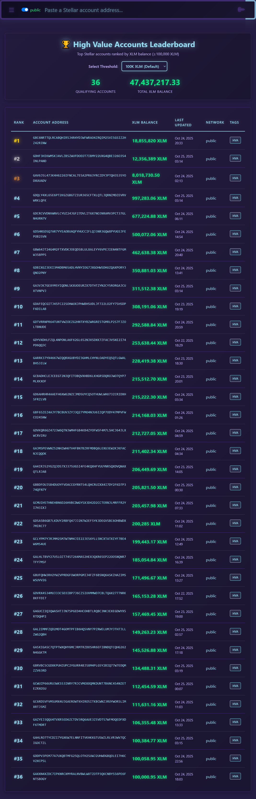
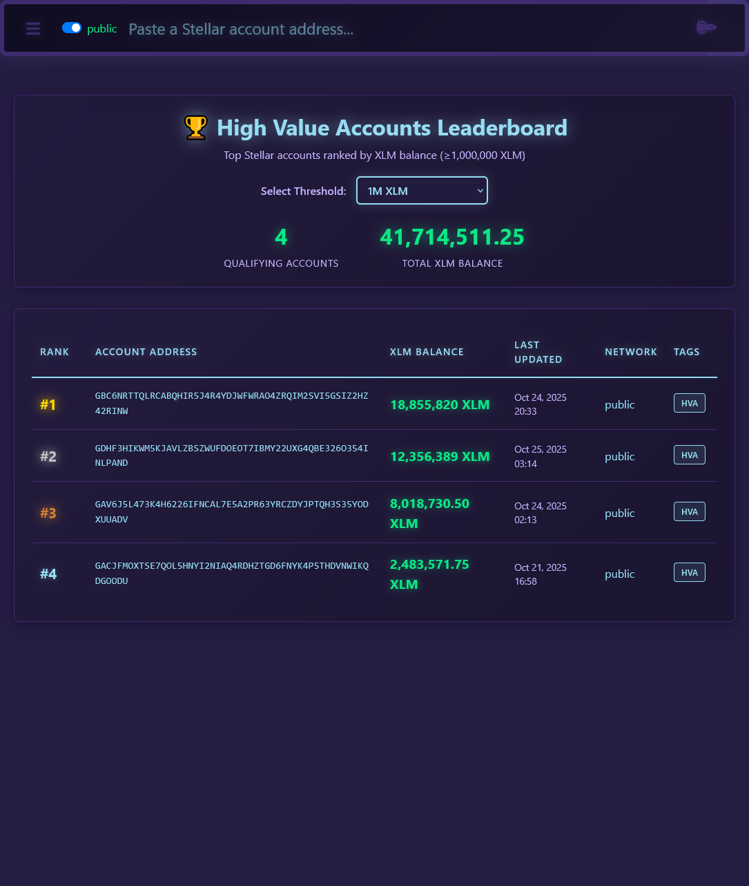
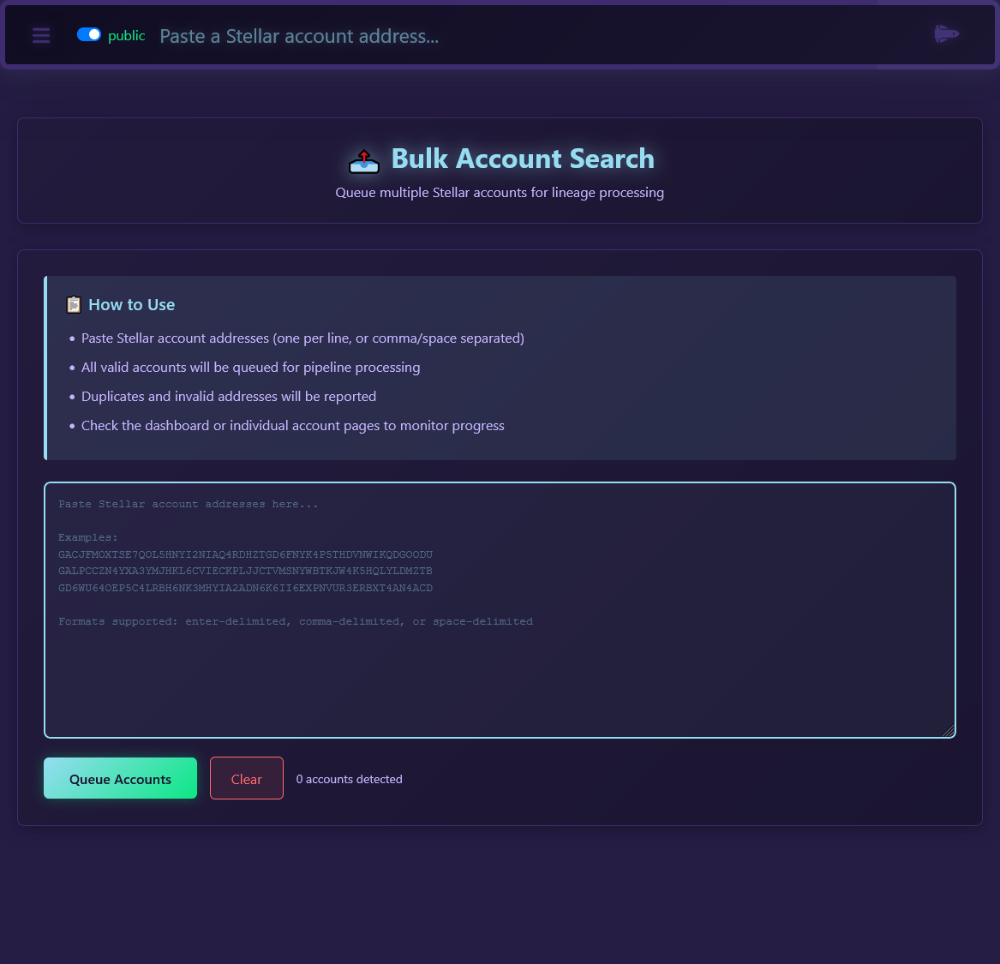
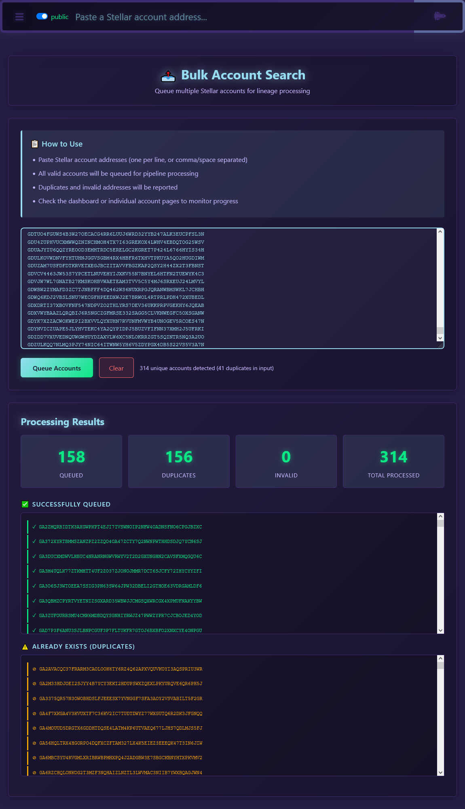

# StellarMapWeb User Guide

## Table of Contents
1. [Introduction](#introduction)
2. [Getting Started](#getting-started)
3. [Main Features](#main-features)
4. [Page-by-Page Guide](#page-by-page-guide)
5. [Visualization Modes](#visualization-modes)
6. [Query Builder](#query-builder)
7. [Network Selection](#network-selection)
8. [Themes](#themes)
9. [Tips & Best Practices](#tips--best-practices)
10. [Advanced Features](#advanced-features)
11. [Admin Portal Configuration](#admin-portal-configuration)
12. [API Endpoints](#api-endpoints)
13. [Keyboard Shortcuts](#keyboard-shortcuts)
14. [FAQ](#faq)
15. [Support & Resources](#support--resources)
16. [Glossary](#glossary)
17. [Version Information](#version-information)

---

## Introduction

**StellarMapWeb** is an interactive web application for visualizing Stellar blockchain account lineage and relationships. It shows you how accounts were created, who created them, and the entire family tree of account relationships.

### What Can You Do?
- 🔍 **Search** for any Stellar account and see its creation history
- 🌳 **Visualize** account relationships in beautiful tree diagrams
- 📊 **Discover** high-value accounts (>1M XLM balance)
- 🔎 **Query** the database with powerful filtering tools
- 📦 **Bulk Process** multiple accounts at once

---

## Getting Started

### Network Toggle
At the top of every page, you'll see a network toggle switch:
- **🌐 public** - Stellar mainnet (real transactions)
- **🧪 testnet** - Stellar testnet (for testing)

Simply click the toggle to switch between networks.

### Basic Workflow
1. **Enter an account address** in the search field
2. **View the lineage visualization** showing account relationships
3. **Explore details** by hovering over accounts in the tree
4. **Switch visualization modes** between Radial and Tidy Tree
5. **Customize spacing** using the slider controls

---

## Main Features

### 1. Account Lineage Visualization
Shows the complete creation hierarchy:
- **Creator Account** (parent) - Who created this account
- **Target Account** (you searched for)
- **Child Accounts** - Accounts created by the target account

### 2. Real-Time Data
Data is fetched from multiple sources:
- **Horizon API** - Official Stellar API
- **Stellar Expert** - Enhanced account metadata
- **Google BigQuery** - Fast bulk queries for recent accounts (<1 year old)

### 3. Interactive Tree Diagrams
- **Radial Layout** - Circular tree emanating from center
- **Tidy Tree Layout** - Traditional hierarchical tree
- **Zoom & Pan** - Navigate large trees easily
- **Smart Tooltips** - Hover to see account details

### 4. High Value Account (HVA) Tracking
- Automatically identifies accounts with >1M XLM
- Ranks accounts by balance
- Shows 24-hour ranking changes
- Event-based history tracking

---

## Page-by-Page Guide

### 🏠 Home Page (`/`)



**What You See:**
- Application overview and description
- Quick navigation cards to main features
- Network selector at the top

**Key Features:**
- **Account Lineage** - Track account creation relationships
- **Radial Tree** - Interactive D3.js visualization
- **Network Data** - Real-time data from Horizon API and Stellar Expert

**How to Use:**
1. Read the overview to understand the application
2. Use the navigation to access different features
3. Select your network (public/testnet) before starting

---

### 📊 Dashboard (`/dashboard`)



**What You See:**
- **Alerts & Recommendations** section (top priority)
  - Stuck Records Alert - Shows accounts stuck in processing
  - Pipeline Failures - Displays failed stage executions
  
- **BigQuery Cost Tracking**
  - Cost Limit per query ($0.17)
  - Size Limit (2 GB max data scanned)
  - Estimated monthly cost (7-day average)
  - Pipeline mode indicator

- **Database Health**
  - Total Accounts in cache
  - Fresh Records (up to date)
  - Stale Records (needs refresh)
  - Stuck Records (requires attention)
  - Pending (being processed)
  - In Progress (actively processing)
  - Completed (finished successfully)
  - Re-Inquiry (needs reprocessing)

**How to Use:**
1. Check alerts first - address any stuck records or failures
2. Monitor BigQuery costs to stay within budget
3. Review database health to ensure system is running smoothly
4. Click "View in Admin" buttons for detailed information
5. Use this page as your system health overview

**Quick Actions:**
- Click any "View in Admin" button to see detailed records
- Monitor stuck records count - if high, check cron jobs
- Track BigQuery costs to prevent overages

---

### 🔍 Account Search & Lineage (`/search`)



**What You See:**
- Search input field for Stellar account address
- Network selector (public/testnet)
- Visualization toggle (Radial ⟷ Tidy Tree)
- Interactive tree diagram
- Account details panels
- Zoom & pan controls
- Spacing sliders (Tidy Tree only)

**How to Use:**

#### Step 1: Enter Account Address
```
Example addresses to try:
• Public: GACJFMOXITSE7Q0L5HNYI2N1AQ4RDHZTGD6FNYK4P5THDVWIKQDG0ODU
• Testnet: GBF2JM3A5UF3MJTUBCRYJ6LWVWP4XNDRXTOJGHMLYC7WXQ7JTKILJKK4
```

Paste a valid Stellar account address (starts with G, 56 characters long) into the search field.

#### Step 2: View Results
The page will display:
- **Target Account Card** (left) - The account you searched for
  - Account address
  - XLM balance
  - Home domain (if set)
  - Flags (HVA badge if >1M XLM)
  - Trustlines and assets
  
- **Creator Account Card** (right) - Who created this account
  - Same details as target account
  - Shows the parent in the hierarchy

- **Account Lineage Tree** - Visual representation
  - Center: Your searched account
  - Branches: Child accounts created by this account
  - Nodes: Individual accounts (click to explore)

#### Step 3: Interact with Visualization
- **Toggle Mode**: Switch between Radial and Tidy Tree layouts
- **Hover**: See account details in tooltip
- **Click Node**: Navigate to that account's lineage
- **Zoom**: Use mouse wheel or +/- buttons
- **Pan**: Click and drag to move the tree
- **Fit to Window**: Click button to auto-fit the entire tree

#### Step 4: Adjust Spacing (Tidy Tree Only)
Three sliders appear in Tidy Tree mode:
- **Vertical Spacing** (0.5x - 3.0x) - Space between levels
- **Min Child Distance** (0.3x - 1.5x) - Spacing for few children
- **Max Child Distance** (1.0x - 3.0x) - Spacing for many children

**Real-Time Updates:**
If the account is being processed, you'll see:
- Pending status indicator
- Stage execution progress
- Automatic refresh when data is ready

---

### 🌳 Tree Visualization (`/tree/`)

**Dedicated Visualization Page**

**What You See:**
- Full-screen interactive tree diagram
- Same controls as search page
- Cleaner interface focused on visualization

**How to Use:**
1. Navigate from search results or enter URL with `?account=ADDRESS&network=public`
2. Use all the same controls as the search page
3. Perfect for presenting or sharing visualizations
4. Bookmark specific account trees

**Visualization Controls:**
- **Mode Toggle**: Switch layouts with one click
- **Zoom Controls**: +/- buttons or mouse wheel
- **Fit to Window**: Auto-resize to show entire tree
- **Spacing Sliders**: Fine-tune tree layout (Tidy Tree)

---

### 🏆 High Value Accounts Leaderboard (`/web/high-value-accounts/`)

The HVA Leaderboard offers multiple threshold views to explore accounts at different wealth levels.

#### Default View (100K XLM)

*Default threshold showing accounts with ≥100K XLM balance*

#### 10K XLM Threshold

*Lower threshold view showing accounts with ≥10K XLM*

#### 50K XLM Threshold

*Mid-tier threshold showing accounts with ≥50K XLM*

#### 1M XLM Threshold

*Premium threshold showing accounts with ≥1M XLM (ultra high-value accounts)*

**What You See:**
- **Threshold Selector** - Dropdown to switch between different XLM thresholds
- Total HVA count and combined XLM balance for selected threshold
- Sortable table with ranked accounts
- 24-hour ranking change indicators
- Account details and tags

**Table Columns:**
- **Rank** - Current position (gold #1)
- **Account Address** - Clickable link to lineage
- **XLM Balance** - Current balance in XLM
- **Last Updated** - Timestamp of last data refresh
- **Network** - public or testnet
- **Tags** - HVA badge

**Ranking Change Indicators:**
- ⬆️ **Green Arrow** - Rank improved (moved up)
- ⬇️ **Red Arrow** - Rank decreased (moved down)
- 🆕 **Blue Badge** - New entry to leaderboard
- 🔻 **Gray Badge** - Dropped off leaderboard
- **Percentage** - Shows magnitude of change

**How to Use:**

#### Step 1: Select Threshold
Use the dropdown selector at the top to choose your wealth threshold:
- **10K XLM** - Entry-level significant accounts
- **50K XLM** - Mid-tier holders
- **100K XLM** - Default view (high-value accounts)
- **500K XLM** - Very wealthy accounts
- **750K XLM** - Ultra-wealthy accounts
- **1M XLM** - Premium whale accounts

The threshold list is fully configurable by administrators through the admin portal.

#### Step 2: Explore Rankings
1. View the leaderboard to see richest accounts at your selected threshold
2. Click any account address to see its lineage
3. Sort by clicking column headers
4. Monitor 24h changes to see market movements
5. Filter by network if needed

**Use Cases:**
- Identify whales and large holders
- Track wealth distribution
- Monitor market influencers
- Find interesting accounts to explore

---

### 🔍 Query Builder (`/web/query-builder/`)


**What You See:**
- Pre-defined query dropdown
- Custom filter builder
- Result limit selector
- Execute button
- Results table

**Pre-Defined Queries:**
1. **Stuck Accounts** - Accounts stuck in processing
2. **Orphan Accounts** - Accounts with unknown creators
3. **Failed Pipeline Stages** - Stage executions that failed
4. **High XLM Balance Accounts** - Accounts with >100 XLM
5. **Recent Cache Entries** - Recently updated cache records
6. **Pending Pipeline Jobs** - Accounts awaiting processing
7. **HVA Accounts** - Accounts with >1M XLM
8. **Accounts by Home Domain** - Filter by domain
9. **Failed Account Lookups** - Accounts that couldn't be found
10. **Recent HVA Changes** - Latest ranking changes

**Custom Filter Builder:**

#### Step 1: Select Table
Choose from:
- **lineage** - Account creation relationships
- **cache** - Cached search results
- **hva** - High value accounts
- **stages** - Pipeline stage executions
- **hva_changes** - HVA ranking change events

#### Step 2: Add Filters
Click "+ Add Filter" and configure:
- **Column** - Select from available columns
  - lineage: account, creator, balance, home_domain, is_hva, flags, trustlines, network, etc.
  - cache: account, network, status, cached_json, created_at, updated_at
  - hva: account, balance, rank, network, home_domain, flags, trustlines, etc.
  - stages: account, stage_name, status, error_message, network, execution_time
  - hva_changes: account, event_type, old_rank, new_rank, balance, timestamp, network

- **Operator** - Choose comparison
  - `equals` - Exact match
  - `contains` - Partial match (text)
  - `gt` (greater than) - Numeric comparison
  - `lt` (less than) - Numeric comparison
  - `gte` (greater or equal)
  - `lte` (less or equal)

- **Value** - Enter search value

#### Step 3: Set Filters (AND Logic)
All filters are combined with AND logic:
```
Example: Find accounts with balance > 1000 AND home_domain contains "stellar"
Filter 1: xlm_balance > 1000
Filter 2: home_domain contains stellar
```

#### Step 4: Choose Result Limit
Select how many records to return:
- 50 records
- 100 records (default)
- 250 records
- 500 records

#### Step 5: Execute Query
Click "🔍 EXECUTE QUERY" button

**Results Table:**
- Sortable columns (click header)
- Clickable account links (opens lineage in new tab)
- Network-aware filtering
- JSON data display for complex fields

**Example Queries:**

**Find wealthy accounts with low trustlines:**
```
Table: lineage
Filter 1: xlm_balance > 10000
Filter 2: trustline_count < 5
Network: public
```

**Find stuck accounts:**
```
Table: cache
Filter 1: status equals PENDING
Filter 2: updated_at < 2025-10-20
Network: public
```

**Find failed pipeline stages:**
```
Table: stages
Filter 1: status equals FAILED
Network: public
```

**Performance Safeguards:**
- Adaptive scan limits prevent runaway queries
- Dense data (lineage, cache): 10x multiplier
- Sparse data (HVA): 100x multiplier
- Network filtering reduces dataset size

---

### 📦 Bulk Account Search (`/web/bulk-search/`)



**What You See:**
- Large text area for multiple account addresses
- "How to Use" instructions
- Submit button
- Results summary

**How to Use:**

#### Step 1: Prepare Account List
Format your accounts (one per line or comma/space separated):
```
GACJFMOXITSE7Q0L5HNYI2N1AQ4RDHZTGD6FNYK4P5THDVWIKQDG0ODU
GALPCCCZN4YXA3YMJHKL6CVIECKPLJJCTVMSNYWBTKJW4K5HQLYLDMKB
GD6WU64OEP5C4LRBH6NK3MHYIA2ADN6K6II6EXPNVUR3ERBXT4AN4ACD
```

Or comma-separated:
```
GACJFMOXITSE7Q0L5HNYI2N1AQ4RDHZTGD6FNYK4P5THDVWIKQDG0ODU, GALPCCCZN4YXA3YMJHKL6CVIECKPLJJCTVMSNYWBTKJW4K5HQLYLDMKB
```

#### Step 2: Paste into Text Area
Paste your list of accounts into the large text box

#### Step 3: Submit for Processing
Click the submit button to queue all accounts



#### Step 4: Monitor Progress
The system will:
- Validate each address
- Remove duplicates
- Queue valid accounts for processing
- Report invalid addresses
- Show success/error counts

**Results Show:**
- **Valid Accounts** - Successfully queued
- **Invalid Addresses** - Rejected with reason
- **Duplicates** - Removed automatically
- **Total Queued** - How many accounts are processing

**What Happens Next:**
All queued accounts are processed through the pipeline:
1. Account data fetched from Horizon API
2. Creator identified via BigQuery or API
3. Child accounts discovered
4. Lineage stored in database
5. Available for visualization on search page

**Monitoring Progress:**
- Check the Dashboard for processing status
- Search for individual accounts to see results
- Use Query Builder to find pending/completed accounts

**Best Practices:**
- Queue up to 100 accounts at a time
- Check Dashboard for stuck records before large batches
- Verify network selection before submitting
- Save your list - results are cached for 12 hours

---

## Visualization Modes

### Radial Tree Layout

**Appearance:**
- Circular design emanating from center
- Target account in the middle
- Branches radiate outward
- Compact for wide hierarchies

**Best For:**
- Accounts with many children
- Aesthetic presentations
- Symmetrical viewing
- Dense family trees

**Controls:**
- Toggle mode switch (top)
- Zoom +/- buttons
- Fit to window button
- Mouse wheel zoom
- Click-drag pan

**Spacing:**
Fixed spacing optimized for circular layout

---

### Tidy Tree Layout

**Appearance:**
- Traditional hierarchical tree
- Left-to-right flow
- Dynamic line lengths based on children count
- Optimized typography

**Best For:**
- Linear hierarchies
- Detailed exploration
- Print/export
- Deep family trees

**Controls:**
- Toggle mode switch (top)
- Zoom +/- buttons
- Fit to window button
- Mouse wheel zoom
- Click-drag pan
- **3 Spacing Sliders:**

#### Vertical Spacing (0.5x - 3.0x)
Controls space between tree levels (up/down distance)
- **Low (0.5x)** - Compact, more nodes visible
- **Medium (1.0x)** - Default, balanced spacing
- **High (3.0x)** - Spacious, easier to read

#### Min Child Distance (0.3x - 1.5x)
Controls horizontal spacing for nodes with FEW children
- **Low (0.3x)** - Tight clustering
- **Medium (0.8x)** - Default spacing
- **High (1.5x)** - Wide spread

#### Max Child Distance (1.0x - 3.0x)
Controls horizontal spacing for nodes with MANY children
- **Low (1.0x)** - Compact branches
- **Medium (2.0x)** - Default spacing
- **High (3.0x)** - Very wide branches

**Spacing Tips:**
- Increase vertical spacing for tall trees
- Decrease min/max for compact view
- Increase max for wide hierarchies
- All settings persist across page refreshes

---

## Query Builder

### Available Tables

#### 1. Lineage Table
**Stores account creation relationships**

Columns:
- `stellar_account` - Account address
- `stellar_creator_account` - Who created this account
- `network_name` - public or testnet
- `xlm_balance` - Current XLM balance
- `home_domain` - Account's home domain
- `is_hva` - High value account flag (>1M XLM)
- `flags` - Account flags (JSON)
- `trustline_count` - Number of trustlines
- `trustlines` - Trustline details (JSON)
- `num_child_accounts` - Count of child accounts
- `created_at` - Record creation time
- `updated_at` - Last update time

Use for:
- Finding accounts by balance
- Filtering by home domain
- Discovering HVA accounts
- Analyzing trustlines

---

#### 2. Cache Table
**Stores cached search results**

Columns:
- `stellar_account` - Cached account
- `network` - Network name
- `cached_json` - Full lineage data (JSON)
- `status` - FRESH, STALE, PENDING, etc.
- `created_at` - Cache creation
- `updated_at` - Last refresh
- `expires_at` - Cache expiration (12 hours)

Use for:
- Finding stale caches
- Identifying stuck accounts
- Monitoring cache health
- Debugging pipeline issues

---

#### 3. HVA Table
**High value accounts (>1M XLM)**

Columns:
- `stellar_account` - Account address
- `network_name` - Network
- `xlm_balance` - Current balance
- `rank` - Current leaderboard rank
- `home_domain` - Domain
- `flags` - Account flags
- `trustline_count` - Trustlines
- `trustlines` - Trustline data
- `created_at` - First detected
- `updated_at` - Last update

Use for:
- Ranking by balance
- Finding whale accounts
- Analyzing HVA distribution
- Tracking rich accounts

---

#### 4. Stages Table
**Pipeline stage execution tracking**

Columns:
- `stellar_account` - Account being processed
- `stage_name` - Pipeline stage
- `status` - PENDING, IN_PROGRESS, COMPLETED, FAILED
- `network` - Network name
- `error_message` - Failure reason
- `execution_time` - Processing duration
- `started_at` - Start time
- `completed_at` - End time

Use for:
- Debugging pipeline failures
- Monitoring performance
- Finding stuck stages
- Analyzing execution times

---

#### 5. HVA Changes Table
**HVA ranking change events**

Columns:
- `stellar_account` - Account
- `event_type` - ENTERED, EXITED, RANK_UP, RANK_DOWN
- `old_rank` - Previous rank
- `new_rank` - Current rank
- `old_balance` - Previous balance
- `new_balance` - Current balance
- `network` - Network name
- `timestamp` - When change occurred
- `change_magnitude` - Rank movement size

Use for:
- Tracking ranking changes
- Identifying new HVAs
- Monitoring leaderboard movements
- Historical analysis

---

## Network Selection

### Public Network (Mainnet)
- Real Stellar transactions
- Live XLM balances
- Production accounts
- Actual market data
- Select for real-world exploration

### Testnet
- Test network
- Fake XLM (no real value)
- Development accounts
- Safe for experimentation
- Select for testing features

**Switching Networks:**
1. Click the toggle switch at top of any page
2. Page automatically reloads with new network
3. All queries filter to selected network
4. Network selection persists across pages

---

## Themes

StellarMapWeb offers three cyberpunk-inspired themes:

### 1. Cyberpunk (Default)
- Purple and cyan color palette
- Neon glow effects
- Dark background
- High contrast

### 2. Borg Green
- Matrix-style green
- Terminal aesthetic
- Sci-fi vibes
- Easy on eyes

### 3. Predator Red
- Red and black
- Aggressive styling
- Heat vision feel
- High intensity

**How to Switch Themes:**
1. Look for theme selector (typically in menu or settings)
2. Click to cycle through themes
3. Theme persists across sessions
4. All pages adopt new theme instantly

---

## Tips & Best Practices

### Performance Tips

**1. Use Fresh Cache**
- Results are cached for 12 hours
- First search may take 10-30 seconds
- Subsequent searches are instant
- Check Dashboard for cache status

**2. BigQuery Cost Management**
- Accounts <1 year old use fast BigQuery
- Older accounts use cached database
- Cost limit: $0.17 per query
- Size limit: 2 GB per query
- Pipeline falls back to API if limits exceeded

**3. Bulk Search Efficiently**
- Queue multiple accounts at once
- System processes in background
- Check Dashboard for progress
- Results available when COMPLETED

**4. Optimize Visualizations**
- Use Radial mode for wide trees
- Use Tidy Tree for deep hierarchies
- Adjust spacing for readability
- Fit to window before zooming
- Hide browser dev tools for more space

### Search Tips

**1. Account Address Format**
- Must start with 'G'
- Exactly 56 characters
- Case-sensitive
- Example: `GACJFMOXITSE7Q0L5HNYI2N1AQ4RDHZTGD6FNYK4P5THDVWIKQDG0ODU`

**2. Finding Interesting Accounts**
- Start with HVA Leaderboard
- Explore top-ranked accounts
- Follow lineage branches
- Check Dashboard for recent activity

**3. Network Awareness**
- Always verify network selection
- Public = real data
- Testnet = test data
- Filter Query Builder by network

### Query Builder Tips

**1. Start with Pre-Defined Queries**
- Learn by example
- Understand table structures
- See common patterns
- Modify for your needs

**2. Build Custom Filters Incrementally**
- Start with one filter
- Test results
- Add more filters gradually
- Use AND logic effectively

**3. Manage Result Limits**
- Start with 100 records
- Increase if needed
- Large limits may be slower
- Adaptive scan limits prevent timeouts

**4. Understand Operators**
- `equals` - Exact match only
- `contains` - Partial text match
- `gt/lt` - Numeric comparisons
- Use appropriate operator for data type

### Visualization Tips

**1. Navigation**
- Click any node to explore that account
- Use breadcrumbs to navigate back
- Bookmark interesting trees
- Share URLs with others

**2. Reading the Tree**
- **Center/Root** - Your searched account
- **Parent** - Creator account
- **Children** - Accounts created by target
- **Depth** - Generational distance

**3. Tooltips**
- Hover over any node
- See account details
- View balance and flags
- Quick preview without clicking

**4. Spacing Adjustments** (Tidy Tree)
- Dense trees: Decrease spacing
- Sparse trees: Increase spacing
- Tall trees: Increase vertical
- Wide trees: Increase max distance

### Troubleshooting

**Account Not Found:**
- Verify address is correct (56 chars, starts with G)
- Check network selection
- Account may not exist
- Try searching creator account instead

**Stuck in PENDING:**
- Check Dashboard for alerts
- Pipeline may be processing
- Wait 5-10 minutes and refresh
- Check cron jobs are running

**No Children Shown:**
- Account may not have created any children
- BigQuery limit may have been exceeded
- Child discovery is limited to 100,000 accounts
- Check API fallback was successful

**Query Builder No Results:**
- Verify filters are correct
- Check network filter
- Result limit may be too low
- Table may have no matching records

**Visualization Not Loading:**
- Refresh the page
- Clear browser cache
- Check browser console for errors
- Ensure JavaScript is enabled

---

## Advanced Features

### Account Enrichment
Each account shows:
- **Balance** - Current XLM balance
- **Home Domain** - Associated website/service
- **Flags** - Account properties (auth_required, etc.)
- **Trustlines** - Assets the account trusts
- **HVA Badge** - If balance >1M XLM

### Pipeline Modes
1. **BIGQUERY_WITH_API_FALLBACK** - Use BigQuery first, fallback to API
2. **API_ONLY** - Only use Horizon API and Stellar Expert
3. **BIGQUERY_ONLY** - Only use BigQuery (may fail if limits exceeded)

### HVA Ranking System
- **Event-based tracking** - Only records meaningful changes
- **480x more efficient** than snapshots
- **Change types:**
  - `ENTERED` - New account crossed 1M XLM threshold
  - `EXITED` - Account dropped below 1M XLM
  - `RANK_UP` - Account moved up in rankings
  - `RANK_DOWN` - Account moved down in rankings

### Database Tables
All data stored in Astra DB (Cassandra):
- **Lineage** - Account relationships
- **Cache** - Search result caching (12-hour TTL)
- **HVA** - High value account tracking
- **Stages** - Pipeline execution tracking
- **HVA Changes** - Ranking change events

---

## Admin Portal Configuration

The Django admin portal provides advanced configuration for BigQuery pipeline settings and scheduler control. Access it at `/admin/` (requires authentication).

### BigQuery Pipeline Configuration


**Configuration Options:**
- **Cost Limit** ($0.17 per query) - Control BigQuery spending
- **Size Limit** (2 GB) - Limit data scanned per query
- **Pipeline Mode** - BIGQUERY_WITH_API_FALLBACK, API_ONLY, or BIGQUERY_ONLY
- **Age Limits** - Restrict queries by account age
- **API Server Selection** - Choose Horizon API server (mainnet/testnet)
- **Stage Timeouts** - Control pipeline stage execution limits
- **Cache Settings** - Configure result caching behavior
- **Child Discovery Settings** - Control child account pagination

**Use Cases:**
- Adjust cost limits based on usage patterns
- Switch pipeline modes for testing or cost optimization
- Fine-tune timeout values for performance
- Enable/disable specific pipeline features

### API Rate Limiter Configuration


**Rate Limiting Settings:**
- **Rate Limits** - Control API request rates to prevent abuse
- **Horizon API Limits** - Configure limits for Stellar Horizon API calls
- **Stellar Expert Limits** - Set request limits for Stellar Expert API
- **Custom Rules** - Define rate limits per endpoint or IP address

**Configuration Options:**
- **Requests per second** - Maximum API calls per second
- **Requests per minute** - Maximum API calls per minute
- **Burst allowance** - Temporary spike tolerance
- **Cooldown period** - Time to wait after hitting limits

**Monitoring:**
- **Current usage** - Real-time API call statistics
- **Rate limit hits** - Track when limits are reached
- **Blocked requests** - Monitor rejected API calls
- **Performance metrics** - Response times and throughput

**Best Practices:**
- Set conservative limits to start
- Monitor usage patterns before adjusting
- Use burst allowance for legitimate traffic spikes
- Review blocked requests for potential issues

---

## API Endpoints

For developers and advanced users:

### GET `/api/account-lineage/`
Get account lineage hierarchy
```
?account=GXXX...&network=public
```

### GET `/api/pending-accounts/`
List all pending pipeline accounts

### GET `/api/stage-executions/`
Get pipeline stage execution status
```
?account=GXXX...&network=public
```

### GET `/api/cassandra-query/`
Execute custom Cassandra queries
```
?query=custom&table=lineage&filters=[...]&limit=100&network=public
```

### GET `/api/server-logs/`
Get recent server logs

---

## Keyboard Shortcuts

### Visualization Controls
- **Mouse Wheel** - Zoom in/out
- **Click + Drag** - Pan around tree
- **Double Click** - Fit to window
- **Ctrl + Click** - Open node in new tab

### General
- **Ctrl/Cmd + F** - Focus search field
- **Esc** - Close tooltips/modals

---

## FAQ

**Q: How long does it take to process an account?**
A: Recent accounts (<1 year): 10-30 seconds. Older accounts: 1-5 minutes if not cached.

**Q: Why is my account stuck in PENDING?**
A: Check Dashboard alerts. Pipeline may be processing or encountering errors. Wait 10 minutes, then refresh.

**Q: Can I export the visualization?**
A: Take a screenshot or use browser's print function. Export feature coming soon.

**Q: What's the difference between Radial and Tidy Tree?**
A: Radial is circular and compact. Tidy Tree is hierarchical with adjustable spacing.

**Q: How often is HVA data updated?**
A: HVA balances update every time an account is searched or pipeline processes it.

**Q: Can I query historical data?**
A: HVA Changes table tracks ranking changes over time. Query Builder can filter by date.

**Q: What if BigQuery limit is exceeded?**
A: System automatically falls back to Horizon API and Stellar Expert. May be slower but still works.

**Q: How do I find whale accounts?**
A: Visit HVA Leaderboard or use Query Builder with filter `xlm_balance > 1000000`.

**Q: Can I see testnet accounts?**
A: Yes! Toggle network to "testnet" at top of any page.

**Q: Why are some creator accounts unknown?**
A: Account was created before BigQuery data or via method we can't detect. Shows as orphan.

---

## Support & Resources

### Documentation
- `README.md` - Installation and setup
- `TESTING.md` - Testing infrastructure
- `CONTRIBUTING.md` - Contribution guidelines
- `SECURITY.md` - Security policies
- `HVA_RANKING_SYSTEM.md` - HVA ranking details

### External Resources
- **Stellar Documentation**: https://developers.stellar.org/
- **Horizon API**: https://developers.stellar.org/api/horizon
- **Stellar Expert**: https://stellar.expert/
- **BigQuery**: https://cloud.google.com/bigquery

### Getting Help
- Check Dashboard for system alerts
- Review Query Builder for data insights
- Verify network selection
- Clear browser cache if issues persist

---

## Glossary

**Account** - Stellar blockchain address starting with 'G'

**Creator Account** - The account that created (funded) another account

**Child Account** - An account created by another account

**Lineage** - The family tree of account creation relationships

**HVA** - High Value Account with >1,000,000 XLM balance

**Trustline** - Permission to hold a specific asset

**Home Domain** - Website associated with an account

**Pipeline** - Background processing system for account data

**Cache** - Stored search results (12-hour freshness)

**BigQuery** - Google's data warehouse for fast bulk queries

**Horizon** - Stellar's official API

**Network** - public (mainnet) or testnet

**Status** - Processing state: PENDING, IN_PROGRESS, COMPLETED, FAILED

**Radial Tree** - Circular visualization layout

**Tidy Tree** - Hierarchical visualization layout

---

## Version Information

- **Application Version**: 1.0
- **Last Updated**: October 2025
- **Django Version**: 5.0.2
- **Database**: Astra DB (Cassandra)
- **Frontend**: Vue.js, D3.js, Bootstrap

---

**Happy Exploring! 🚀**

Discover the hidden relationships in the Stellar blockchain and visualize the network like never before.
